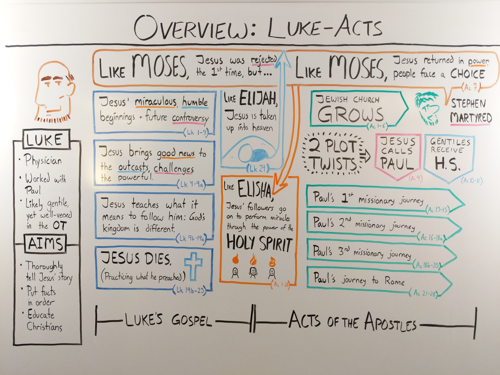

# Acts

The book of Acts is a continuation of the Gospel of Luke.  Major
themes include: Jesus returns to the Father &bull; the Holy Spirit
comes to the church &bull; and Jesus' followers spread his gospel
throughout the world.

### Overview Bible

[Acts Introduction](https://overviewbible.com/acts/)

<figure style="text-align: center;">
  
  <figcaption>Click image to expand into full-screen</figcaption>
</figure>

### Bible Project

**Acts Introduction**
[Part 1: Acts 1-12](https://bibleproject.com/explore/video/acts-1-12/) ...
[Part 2: Acts 13-28](https://bibleproject.com/explore/video/acts-13-28/)

<figure style="text-align: center;">
  
  <figcaption>Click image to expand into full-screen</figcaption>
</figure>

## 2009 Acts Series (Sundays)

{{book.CornerstoneChapel}}

<!-- MASTER: vertical layout for "cell phone" responsive show/hide -->

<table>
  <thead>
    <tr>
      <th></th>
      <th></th>
      <th></th>
    </tr>
  </thead>
  <tbody>

<tr><td> {{book.check1}}20090419{{book.check2}} 1.  </td><td> {{book.cst1}}20090419{{book.cst2}} The Purpose and Person of the Holy Spirit {{book.cst3}}   {{book.b1}}act.1.niv{{book.b2}} ACTS 1      {{book.b3}} </td><td> 04/19/2009   {{book.csg1}}20090419.pdf{{book.csg2}} </td>
<tr><td> {{book.check1}}20090426{{book.check2}} 2.  </td><td> {{book.cst1}}20090426{{book.cst2}} Pentecost: Then and Now                   {{book.cst3}}   {{book.b1}}act.2.niv{{book.b2}} ACTS 2      {{book.b3}} </td><td> 04/26/2009   {{book.csg1}}20090426.pdf{{book.csg2}} </td>
<tr><td> {{book.check1}}20090503{{book.check2}} 3.  </td><td> {{book.cst1}}20090503{{book.cst2}} The Baptism of the Holy Spirit            {{book.cst3}}   {{book.b1}}act.3.niv{{book.b2}} ACTS 2-3    {{book.b3}} </td><td> 05/03/2009   {{book.csg1}}20090503.pdf{{book.csg2}} </td>
<tr><td> {{book.check1}}20090510{{book.check2}} 4.  </td><td> {{book.cst1}}20090510{{book.cst2}} Civil Disobedience                        {{book.cst3}}   {{book.b1}}act.4.niv{{book.b2}} ACTS 4-5    {{book.b3}} </td><td> 05/10/2009   {{book.csg1}}20090510.pdf{{book.csg2}} </td>
<tr><td> {{book.check1}}20090517{{book.check2}} 5.  </td><td> {{book.cst1}}20090517{{book.cst2}} A Martyr's Mission                        {{book.cst3}}   {{book.b1}}act.6.niv{{book.b2}} ACTS 6-7    {{book.b3}} </td><td> 05/17/2009                                              </td>
<tr><td> {{book.check1}}20090524{{book.check2}} 6.  </td><td> {{book.cst1}}20090524{{book.cst2}} Stop Kicking                              {{book.cst3}}   {{book.b1}}act.8.niv{{book.b2}} ACTS 8-9    {{book.b3}} </td><td> 05/24/2009                                              </td>
<tr><td> {{book.check1}}20090607{{book.check2}} 7.  </td><td> {{book.cst1}}20090607{{book.cst2}} Don't Touch That!                         {{book.cst3}}   {{book.b1}}act.10.niv{{book.b2}} ACTS 10-12 {{book.b3}} </td><td> 06/07/2009                                              </td>
<tr><td> {{book.check1}}20090614{{book.check2}} 8.  </td><td> {{book.cst1}}20090614{{book.cst2}} Belief and Behavior                       {{book.cst3}}   {{book.b1}}act.13.niv{{book.b2}} ACTS 13-15 {{book.b3}} </td><td> 06/14/2009                                              </td>
<tr><td> {{book.check1}}20090705{{book.check2}} 9.  </td><td> {{book.cst1}}20090705{{book.cst2}} Same Message, Different Method            {{book.cst3}}   {{book.b1}}act.16.niv{{book.b2}} ACTS 16-18 {{book.b3}} </td><td> 07/05/2009                                              </td>
<tr><td> {{book.check1}}20090712{{book.check2}} 10. </td><td> {{book.cst1}}20090712{{book.cst2}} Run the Race                              {{book.cst3}}   {{book.b1}}act.19.niv{{book.b2}} ACTS 19-21 {{book.b3}} </td><td> 07/12/2009                                              </td>
<tr><td> {{book.check1}}20090726{{book.check2}} 10. </td><td> {{book.cst1}}20090726{{book.cst2}} A Clear Conscience                        {{book.cst3}}   {{book.b1}}act.22.niv{{book.b2}} ACTS 22-25 {{book.b3}} </td><td> 07/26/2009                                              </td>
<tr><td> {{book.check1}}20090802{{book.check2}} 10. </td><td> {{book.cst1}}20090802{{book.cst2}} When Storms Come                          {{book.cst3}}   {{book.b1}}act.26.niv{{book.b2}} ACTS 26-28 {{book.b3}} </td><td> 08/02/2009                                              </td>

  </tbody>
</table>

<!-- COPY: horizontal layout for "desktop/tablet" responsive show/hide (simply add 2 columns to header and replace TWO FROM   TO </td><td> -->

<table>
  <thead>
    <tr>
      <th></th>
      <th></th>
      <th></th>
      <th></th>
      <th></th>
    </tr>
  </thead>
  <tbody>

<tr><td> {{book.check1}}20090419{{book.check2}} 1.  </td><td> {{book.cst1}}20090419{{book.cst2}} The Purpose and Person of the Holy Spirit {{book.cst3}} </td><td> {{book.b1}}act.1.niv{{book.b2}} ACTS 1      {{book.b3}} </td><td> 04/19/2009 </td><td> {{book.csg1}}20090419.pdf{{book.csg2}} </td>
<tr><td> {{book.check1}}20090426{{book.check2}} 2.  </td><td> {{book.cst1}}20090426{{book.cst2}} Pentecost: Then and Now                   {{book.cst3}} </td><td> {{book.b1}}act.2.niv{{book.b2}} ACTS 2      {{book.b3}} </td><td> 04/26/2009 </td><td> {{book.csg1}}20090426.pdf{{book.csg2}} </td>
<tr><td> {{book.check1}}20090503{{book.check2}} 3.  </td><td> {{book.cst1}}20090503{{book.cst2}} The Baptism of the Holy Spirit            {{book.cst3}} </td><td> {{book.b1}}act.3.niv{{book.b2}} ACTS 2-3    {{book.b3}} </td><td> 05/03/2009 </td><td> {{book.csg1}}20090503.pdf{{book.csg2}} </td>
<tr><td> {{book.check1}}20090510{{book.check2}} 4.  </td><td> {{book.cst1}}20090510{{book.cst2}} Civil Disobedience                        {{book.cst3}} </td><td> {{book.b1}}act.4.niv{{book.b2}} ACTS 4-5    {{book.b3}} </td><td> 05/10/2009 </td><td> {{book.csg1}}20090510.pdf{{book.csg2}} </td>
<tr><td> {{book.check1}}20090517{{book.check2}} 5.  </td><td> {{book.cst1}}20090517{{book.cst2}} A Martyr's Mission                        {{book.cst3}} </td><td> {{book.b1}}act.6.niv{{book.b2}} ACTS 6-7    {{book.b3}} </td><td> 05/17/2009 </td><td>                                        </td>
<tr><td> {{book.check1}}20090524{{book.check2}} 6.  </td><td> {{book.cst1}}20090524{{book.cst2}} Stop Kicking                              {{book.cst3}} </td><td> {{book.b1}}act.8.niv{{book.b2}} ACTS 8-9    {{book.b3}} </td><td> 05/24/2009 </td><td>                                        </td>
<tr><td> {{book.check1}}20090607{{book.check2}} 7.  </td><td> {{book.cst1}}20090607{{book.cst2}} Don't Touch That!                         {{book.cst3}} </td><td> {{book.b1}}act.10.niv{{book.b2}} ACTS 10-12 {{book.b3}} </td><td> 06/07/2009 </td><td>                                        </td>
<tr><td> {{book.check1}}20090614{{book.check2}} 8.  </td><td> {{book.cst1}}20090614{{book.cst2}} Belief and Behavior                       {{book.cst3}} </td><td> {{book.b1}}act.13.niv{{book.b2}} ACTS 13-15 {{book.b3}} </td><td> 06/14/2009 </td><td>                                        </td>
<tr><td> {{book.check1}}20090705{{book.check2}} 9.  </td><td> {{book.cst1}}20090705{{book.cst2}} Same Message, Different Method            {{book.cst3}} </td><td> {{book.b1}}act.16.niv{{book.b2}} ACTS 16-18 {{book.b3}} </td><td> 07/05/2009 </td><td>                                        </td>
<tr><td> {{book.check1}}20090712{{book.check2}} 10. </td><td> {{book.cst1}}20090712{{book.cst2}} Run the Race                              {{book.cst3}} </td><td> {{book.b1}}act.19.niv{{book.b2}} ACTS 19-21 {{book.b3}} </td><td> 07/12/2009 </td><td>                                        </td>
<tr><td> {{book.check1}}20090726{{book.check2}} 10. </td><td> {{book.cst1}}20090726{{book.cst2}} A Clear Conscience                        {{book.cst3}} </td><td> {{book.b1}}act.22.niv{{book.b2}} ACTS 22-25 {{book.b3}} </td><td> 07/26/2009 </td><td>                                        </td>
<tr><td> {{book.check1}}20090802{{book.check2}} 10. </td><td> {{book.cst1}}20090802{{book.cst2}} When Storms Come                          {{book.cst3}} </td><td> {{book.b1}}act.26.niv{{book.b2}} ACTS 26-28 {{book.b3}} </td><td> 08/02/2009 </td><td>                                        </td>

  </tbody>
</table>

## 2015-2016 Acts Series (Mid Week)

{{book.CornerstoneChapel}}

<!-- MASTER: vertical layout for "cell phone" responsive show/hide -->

<table>
  <thead>
    <tr>
      <th></th>
      <th></th>
      <th></th>
    </tr>
  </thead>
  <tbody>

<tr><td> {{book.check1}}20151021{{book.check2}} 1.  </td><td> {{book.cst1}}20151021{{book.cst2}} Teaching {{book.cst3}}   {{book.b1}}act.1.niv{{book.b2}}  ACTS 1:1-11      {{book.b3}} </td><td> 10/21/2015   {{book.csg1}}20151021.pdf{{book.csg2}} </td>
<tr><td> {{book.check1}}20151028{{book.check2}} 2.  </td><td> {{book.cst1}}20151028{{book.cst2}} Teaching {{book.cst3}}   {{book.b1}}act.1.niv{{book.b2}}  ACTS 1:12-2:13   {{book.b3}} </td><td> 10/28/2015   {{book.csg1}}20151028.pdf{{book.csg2}} </td>
<tr><td> {{book.check1}}20151104{{book.check2}} 3.  </td><td> {{book.cst1}}20151104{{book.cst2}} Teaching {{book.cst3}}   {{book.b1}}act.2.niv{{book.b2}}  ACTS 2:1-13      {{book.b3}} </td><td> 11/04/2015   {{book.csg1}}20151104.pdf{{book.csg2}} </td>
<tr><td> {{book.check1}}20151118{{book.check2}} 4.  </td><td> {{book.cst1}}20151118{{book.cst2}} Teaching {{book.cst3}}   {{book.b1}}act.2.niv{{book.b2}}  ACTS 2:13-37     {{book.b3}} </td><td> 11/18/2015   {{book.csg1}}20151118.pdf{{book.csg2}} </td>
<tr><td> {{book.check1}}20151202{{book.check2}} 5.  </td><td> {{book.cst1}}20151202{{book.cst2}} Teaching {{book.cst3}}   {{book.b1}}act.2.niv{{book.b2}}  ACTS 2:42-3:26   {{book.b3}} </td><td> 12/02/2015   {{book.csg1}}20151202.pdf{{book.csg2}} </td>
<tr><td> {{book.check1}}20151209{{book.check2}} 6.  </td><td> {{book.cst1}}20151209{{book.cst2}} Teaching {{book.cst3}}   {{book.b1}}act.4.niv{{book.b2}}  ACTS 4           {{book.b3}} </td><td> 12/09/2015   {{book.csg1}}20151209.pdf{{book.csg2}} </td>
<tr><td> {{book.check1}}20151216{{book.check2}} 7.  </td><td> {{book.cst1}}20151216{{book.cst2}} Teaching {{book.cst3}}   {{book.b1}}act.5.niv{{book.b2}}  ACTS 5           {{book.b3}} </td><td> 12/16/2015   {{book.csg1}}20151216.pdf{{book.csg2}} </td>
<tr><td> {{book.check1}}20160106{{book.check2}} 8.  </td><td> {{book.cst1}}20160106{{book.cst2}} Teaching {{book.cst3}}   {{book.b1}}act.6.niv{{book.b2}}  ACTS 6:1-15      {{book.b3}} </td><td> 01/06/2016   {{book.csg1}}20160106.pdf{{book.csg2}} </td>
<tr><td> {{book.check1}}20160113{{book.check2}} 9.  </td><td> {{book.cst1}}20160113{{book.cst2}} Teaching {{book.cst3}}   {{book.b1}}act.7.niv{{book.b2}}  ACTS 7           {{book.b3}} </td><td> 01/13/2016   {{book.csg1}}20160113.pdf{{book.csg2}} </td>
<tr><td> {{book.check1}}20160120{{book.check2}} 10. </td><td> {{book.cst1}}20160120{{book.cst2}} Teaching {{book.cst3}}   {{book.b1}}act.8.niv{{book.b2}}  ACTS 8           {{book.b3}} </td><td> 01/20/2016   {{book.csg1}}20160120.pdf{{book.csg2}} </td>
<tr><td> {{book.check1}}20160127{{book.check2}} 11. </td><td> {{book.cst1}}20160127{{book.cst2}} Teaching {{book.cst3}}   {{book.b1}}act.9.niv{{book.b2}}  ACTS 9           {{book.b3}} </td><td> 01/27/2016   {{book.csg1}}20160127.pdf{{book.csg2}} </td>
<tr><td> {{book.check1}}20160203{{book.check2}} 12. </td><td> {{book.cst1}}20160203{{book.cst2}} Teaching {{book.cst3}}   {{book.b1}}act.10.niv{{book.b2}} ACTS 10          {{book.b3}} </td><td> 02/03/2016   {{book.csg1}}20160203.pdf{{book.csg2}} </td>
<tr><td> {{book.check1}}20160210{{book.check2}} 13. </td><td> {{book.cst1}}20160210{{book.cst2}} Teaching {{book.cst3}}   {{book.b1}}act.11.niv{{book.b2}} ACTS 11-12:19    {{book.b3}} </td><td> 02/10/2016   {{book.csg1}}20160210.pdf{{book.csg2}} </td>
<tr><td> {{book.check1}}20160217{{book.check2}} 14. </td><td> {{book.cst1}}20160217{{book.cst2}} Teaching {{book.cst3}}   {{book.b1}}act.12.niv{{book.b2}} ACTS 12:19-13:41 {{book.b3}} </td><td> 02/17/2016   {{book.csg1}}20160217.pdf{{book.csg2}} </td>
<tr><td> {{book.check1}}20160224{{book.check2}} 15. </td><td> {{book.cst1}}20160224{{book.cst2}} Teaching {{book.cst3}}   {{book.b1}}act.13.niv{{book.b2}} ACTS 13:42-14    {{book.b3}} </td><td> 02/24/2016                                              </td>
<tr><td> {{book.check1}}20160302{{book.check2}} 16. </td><td> {{book.cst1}}20160302{{book.cst2}} Teaching {{book.cst3}}   {{book.b1}}act.15.niv{{book.b2}} ACTS 15:1-29     {{book.b3}} </td><td> 03/02/2016   {{book.csg1}}20160302.pdf{{book.csg2}} </td>
<tr><td> {{book.check1}}20160309{{book.check2}} 17. </td><td> {{book.cst1}}20160309{{book.cst2}} Teaching {{book.cst3}}   {{book.b1}}act.16.niv{{book.b2}} ACTS 15:30-16:40 {{book.b3}} </td><td> 03/09/2016   {{book.csg1}}20160309.pdf{{book.csg2}} </td>
<tr><td> {{book.check1}}20160316{{book.check2}} 18. </td><td> {{book.cst1}}20160316{{book.cst2}} Teaching {{book.cst3}}   {{book.b1}}act.17.niv{{book.b2}} ACTS 17:1-34     {{book.b3}} </td><td> 03/16/2016   {{book.csg1}}20160316.pdf{{book.csg2}} </td>
<tr><td> {{book.check1}}20160330{{book.check2}} 19. </td><td> {{book.cst1}}20160330{{book.cst2}} Teaching {{book.cst3}}   {{book.b1}}act.18.niv{{book.b2}} ACTS 18          {{book.b3}} </td><td> 03/30/2016   {{book.csg1}}20160330.pdf{{book.csg2}} </td>
<tr><td> {{book.check1}}20160406{{book.check2}} 20. </td><td> {{book.cst1}}20160406{{book.cst2}} Teaching {{book.cst3}}   {{book.b1}}act.19.niv{{book.b2}} ACTS 19:1-22     {{book.b3}} </td><td> 04/06/2016   {{book.csg1}}20160406.pdf{{book.csg2}} </td>
<tr><td> {{book.check1}}20160413{{book.check2}} 21. </td><td> {{book.cst1}}20160413{{book.cst2}} Teaching {{book.cst3}}   {{book.b1}}act.20.niv{{book.b2}} ACTS 19:23-20:38 {{book.b3}} </td><td> 04/13/2016   {{book.csg1}}20160413.pdf{{book.csg2}} </td>
<tr><td> {{book.check1}}20160420{{book.check2}} 22. </td><td> {{book.cst1}}20160420{{book.cst2}} Teaching {{book.cst3}}   {{book.b1}}act.21.niv{{book.b2}} ACTS 21-22:29    {{book.b3}} </td><td> 04/20/2016   {{book.csg1}}20160420.pdf{{book.csg2}} </td>
<tr><td> {{book.check1}}20160427{{book.check2}} 23. </td><td> {{book.cst1}}20160427{{book.cst2}} Teaching {{book.cst3}}   {{book.b1}}act.23.niv{{book.b2}} ACTS 23-24       {{book.b3}} </td><td> 04/27/2016   {{book.csg1}}20160427.pdf{{book.csg2}} </td>
<tr><td> {{book.check1}}20160504{{book.check2}} 24. </td><td> {{book.cst1}}20160504{{book.cst2}} Teaching {{book.cst3}}   {{book.b1}}act.25.niv{{book.b2}} ACTS 25-26       {{book.b3}} </td><td> 05/04/2016   {{book.csg1}}20160504.pdf{{book.csg2}} </td>
<tr><td> {{book.check1}}20160511{{book.check2}} 25. </td><td> {{book.cst1}}20160511{{book.cst2}} Teaching {{book.cst3}}   {{book.b1}}act.27.niv{{book.b2}} ACTS 27-28       {{book.b3}} </td><td> 05/11/2016   {{book.csg1}}20160511.pdf{{book.csg2}} </td>

  </tbody>
</table>

<!-- COPY: horizontal layout for "desktop/tablet" responsive show/hide (simply add 2 columns to header and replace TWO FROM   TO </td><td> -->

<table>
  <thead>
    <tr>
      <th></th>
      <th></th>
      <th></th>
      <th></th>
      <th></th>
    </tr>
  </thead>
  <tbody>

<tr><td> {{book.check1}}20151021{{book.check2}} 1.  </td><td> {{book.cst1}}20151021{{book.cst2}} Teaching {{book.cst3}} </td><td> {{book.b1}}act.1.niv{{book.b2}}  ACTS 1:1-11      {{book.b3}} </td><td> 10/21/2015 </td><td> {{book.csg1}}20151021.pdf{{book.csg2}} </td>
<tr><td> {{book.check1}}20151028{{book.check2}} 2.  </td><td> {{book.cst1}}20151028{{book.cst2}} Teaching {{book.cst3}} </td><td> {{book.b1}}act.1.niv{{book.b2}}  ACTS 1:12-2:13   {{book.b3}} </td><td> 10/28/2015 </td><td> {{book.csg1}}20151028.pdf{{book.csg2}} </td>
<tr><td> {{book.check1}}20151104{{book.check2}} 3.  </td><td> {{book.cst1}}20151104{{book.cst2}} Teaching {{book.cst3}} </td><td> {{book.b1}}act.2.niv{{book.b2}}  ACTS 2:1-13      {{book.b3}} </td><td> 11/04/2015 </td><td> {{book.csg1}}20151104.pdf{{book.csg2}} </td>
<tr><td> {{book.check1}}20151118{{book.check2}} 4.  </td><td> {{book.cst1}}20151118{{book.cst2}} Teaching {{book.cst3}} </td><td> {{book.b1}}act.2.niv{{book.b2}}  ACTS 2:13-37     {{book.b3}} </td><td> 11/18/2015 </td><td> {{book.csg1}}20151118.pdf{{book.csg2}} </td>
<tr><td> {{book.check1}}20151202{{book.check2}} 5.  </td><td> {{book.cst1}}20151202{{book.cst2}} Teaching {{book.cst3}} </td><td> {{book.b1}}act.2.niv{{book.b2}}  ACTS 2:42-3:26   {{book.b3}} </td><td> 12/02/2015 </td><td> {{book.csg1}}20151202.pdf{{book.csg2}} </td>
<tr><td> {{book.check1}}20151209{{book.check2}} 6.  </td><td> {{book.cst1}}20151209{{book.cst2}} Teaching {{book.cst3}} </td><td> {{book.b1}}act.4.niv{{book.b2}}  ACTS 4           {{book.b3}} </td><td> 12/09/2015 </td><td> {{book.csg1}}20151209.pdf{{book.csg2}} </td>
<tr><td> {{book.check1}}20151216{{book.check2}} 7.  </td><td> {{book.cst1}}20151216{{book.cst2}} Teaching {{book.cst3}} </td><td> {{book.b1}}act.5.niv{{book.b2}}  ACTS 5           {{book.b3}} </td><td> 12/16/2015 </td><td> {{book.csg1}}20151216.pdf{{book.csg2}} </td>
<tr><td> {{book.check1}}20160106{{book.check2}} 8.  </td><td> {{book.cst1}}20160106{{book.cst2}} Teaching {{book.cst3}} </td><td> {{book.b1}}act.6.niv{{book.b2}}  ACTS 6:1-15      {{book.b3}} </td><td> 01/06/2016 </td><td> {{book.csg1}}20160106.pdf{{book.csg2}} </td>
<tr><td> {{book.check1}}20160113{{book.check2}} 9.  </td><td> {{book.cst1}}20160113{{book.cst2}} Teaching {{book.cst3}} </td><td> {{book.b1}}act.7.niv{{book.b2}}  ACTS 7           {{book.b3}} </td><td> 01/13/2016 </td><td> {{book.csg1}}20160113.pdf{{book.csg2}} </td>
<tr><td> {{book.check1}}20160120{{book.check2}} 10. </td><td> {{book.cst1}}20160120{{book.cst2}} Teaching {{book.cst3}} </td><td> {{book.b1}}act.8.niv{{book.b2}}  ACTS 8           {{book.b3}} </td><td> 01/20/2016 </td><td> {{book.csg1}}20160120.pdf{{book.csg2}} </td>
<tr><td> {{book.check1}}20160127{{book.check2}} 11. </td><td> {{book.cst1}}20160127{{book.cst2}} Teaching {{book.cst3}} </td><td> {{book.b1}}act.9.niv{{book.b2}}  ACTS 9           {{book.b3}} </td><td> 01/27/2016 </td><td> {{book.csg1}}20160127.pdf{{book.csg2}} </td>
<tr><td> {{book.check1}}20160203{{book.check2}} 12. </td><td> {{book.cst1}}20160203{{book.cst2}} Teaching {{book.cst3}} </td><td> {{book.b1}}act.10.niv{{book.b2}} ACTS 10          {{book.b3}} </td><td> 02/03/2016 </td><td> {{book.csg1}}20160203.pdf{{book.csg2}} </td>
<tr><td> {{book.check1}}20160210{{book.check2}} 13. </td><td> {{book.cst1}}20160210{{book.cst2}} Teaching {{book.cst3}} </td><td> {{book.b1}}act.11.niv{{book.b2}} ACTS 11-12:19    {{book.b3}} </td><td> 02/10/2016 </td><td> {{book.csg1}}20160210.pdf{{book.csg2}} </td>
<tr><td> {{book.check1}}20160217{{book.check2}} 14. </td><td> {{book.cst1}}20160217{{book.cst2}} Teaching {{book.cst3}} </td><td> {{book.b1}}act.12.niv{{book.b2}} ACTS 12:19-13:41 {{book.b3}} </td><td> 02/17/2016 </td><td> {{book.csg1}}20160217.pdf{{book.csg2}} </td>
<tr><td> {{book.check1}}20160224{{book.check2}} 15. </td><td> {{book.cst1}}20160224{{book.cst2}} Teaching {{book.cst3}} </td><td> {{book.b1}}act.13.niv{{book.b2}} ACTS 13:42-14    {{book.b3}} </td><td> 02/24/2016 </td><td>                                        </td>
<tr><td> {{book.check1}}20160302{{book.check2}} 16. </td><td> {{book.cst1}}20160302{{book.cst2}} Teaching {{book.cst3}} </td><td> {{book.b1}}act.15.niv{{book.b2}} ACTS 15:1-29     {{book.b3}} </td><td> 03/02/2016 </td><td> {{book.csg1}}20160302.pdf{{book.csg2}} </td>
<tr><td> {{book.check1}}20160309{{book.check2}} 17. </td><td> {{book.cst1}}20160309{{book.cst2}} Teaching {{book.cst3}} </td><td> {{book.b1}}act.16.niv{{book.b2}} ACTS 15:30-16:40 {{book.b3}} </td><td> 03/09/2016 </td><td> {{book.csg1}}20160309.pdf{{book.csg2}} </td>
<tr><td> {{book.check1}}20160316{{book.check2}} 18. </td><td> {{book.cst1}}20160316{{book.cst2}} Teaching {{book.cst3}} </td><td> {{book.b1}}act.17.niv{{book.b2}} ACTS 17:1-34     {{book.b3}} </td><td> 03/16/2016 </td><td> {{book.csg1}}20160316.pdf{{book.csg2}} </td>
<tr><td> {{book.check1}}20160330{{book.check2}} 19. </td><td> {{book.cst1}}20160330{{book.cst2}} Teaching {{book.cst3}} </td><td> {{book.b1}}act.18.niv{{book.b2}} ACTS 18          {{book.b3}} </td><td> 03/30/2016 </td><td> {{book.csg1}}20160330.pdf{{book.csg2}} </td>
<tr><td> {{book.check1}}20160406{{book.check2}} 20. </td><td> {{book.cst1}}20160406{{book.cst2}} Teaching {{book.cst3}} </td><td> {{book.b1}}act.19.niv{{book.b2}} ACTS 19:1-22     {{book.b3}} </td><td> 04/06/2016 </td><td> {{book.csg1}}20160406.pdf{{book.csg2}} </td>
<tr><td> {{book.check1}}20160413{{book.check2}} 21. </td><td> {{book.cst1}}20160413{{book.cst2}} Teaching {{book.cst3}} </td><td> {{book.b1}}act.20.niv{{book.b2}} ACTS 19:23-20:38 {{book.b3}} </td><td> 04/13/2016 </td><td> {{book.csg1}}20160413.pdf{{book.csg2}} </td>
<tr><td> {{book.check1}}20160420{{book.check2}} 22. </td><td> {{book.cst1}}20160420{{book.cst2}} Teaching {{book.cst3}} </td><td> {{book.b1}}act.21.niv{{book.b2}} ACTS 21-22:29    {{book.b3}} </td><td> 04/20/2016 </td><td> {{book.csg1}}20160420.pdf{{book.csg2}} </td>
<tr><td> {{book.check1}}20160427{{book.check2}} 23. </td><td> {{book.cst1}}20160427{{book.cst2}} Teaching {{book.cst3}} </td><td> {{book.b1}}act.23.niv{{book.b2}} ACTS 23-24       {{book.b3}} </td><td> 04/27/2016 </td><td> {{book.csg1}}20160427.pdf{{book.csg2}} </td>
<tr><td> {{book.check1}}20160504{{book.check2}} 24. </td><td> {{book.cst1}}20160504{{book.cst2}} Teaching {{book.cst3}} </td><td> {{book.b1}}act.25.niv{{book.b2}} ACTS 25-26       {{book.b3}} </td><td> 05/04/2016 </td><td> {{book.csg1}}20160504.pdf{{book.csg2}} </td>
<tr><td> {{book.check1}}20160511{{book.check2}} 25. </td><td> {{book.cst1}}20160511{{book.cst2}} Teaching {{book.cst3}} </td><td> {{book.b1}}act.27.niv{{book.b2}} ACTS 27-28       {{book.b3}} </td><td> 05/11/2016 </td><td> {{book.csg1}}20160511.pdf{{book.csg2}} </td>

  </tbody>
</table>

