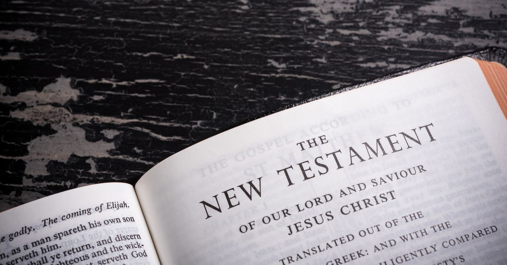

# New Testament

The New Testament includes 27 books about Jesus’ ministry and what it
means to follow him. 

The New Testament books fall into five general categories
_([find out more](https://overviewbible.com/new-testament-books/))_:

1. The Gospels:
   - {{book.cb1}}Matthew{{book.cb2}}{{book.cb3}}         {{book.Matthew}}
   - {{book.cb1}}Mark{{book.cb2}}{{book.cb3}}            {{book.Mark}}
   - {{book.cb1}}Luke{{book.cb2}}{{book.cb3}}            {{book.Luke}}
   - {{book.cb1}}John{{book.cb2}}{{book.cb3}}            {{book.John}}
2. The single book of Acts
   - {{book.cb1}}Acts{{book.cb2}}{{book.cb3}}            {{book.Acts}}
3. Paul’s letters to churches:
   - {{book.cb1}}Romans{{book.cb2}}{{book.cb3}}          {{book.Romans}}
   - {{book.cb1}}1Corinthians{{book.cb2}}{{book.cb3}}    {{book.1Corinthians}}
   - {{book.cb1}}2Corinthians{{book.cb2}}{{book.cb3}}    {{book.2Corinthians}}
   - {{book.cb1}}Galatians{{book.cb2}}{{book.cb3}}       {{book.Galatians}}
   - {{book.cb1}}Ephesians{{book.cb2}}{{book.cb3}}       {{book.Ephesians}}
   - {{book.cb1}}Philippians{{book.cb2}}{{book.cb3}}     {{book.Philippians}}
   - {{book.cb1}}Colossians{{book.cb2}}{{book.cb3}}      {{book.Colossians}}
   - {{book.cb1}}1Thessalonians{{book.cb2}}{{book.cb3}}  {{book.1Thessalonians}}
   - {{book.cb1}}2Thessalonians{{book.cb2}}{{book.cb3}}  {{book.2Thessalonians}}
4. Paul’s letters to church leaders:
   - {{book.cb1}}1Timothy{{book.cb2}}{{book.cb3}}        {{book.1Timothy}}
   - {{book.cb1}}2Timothy{{book.cb2}}{{book.cb3}}        {{book.2Timothy}}
   - {{book.cb1}}Titus{{book.cb2}}{{book.cb3}}           {{book.Titus}}
   - {{book.cb1}}Philemon{{book.cb2}}{{book.cb3}}        {{book.Philemon}}
5. A collection of letters sent out (mostly) to large groups of people:
   - {{book.cb1}}Hebrews{{book.cb2}}{{book.cb3}}         {{book.Hebrews}}
   - {{book.cb1}}James{{book.cb2}}{{book.cb3}}           {{book.James}}
   - {{book.cb1}}1Peter{{book.cb2}}{{book.cb3}}          {{book.1Peter}}
   - {{book.cb1}}2Peter{{book.cb2}}{{book.cb3}}          {{book.2Peter}}
   - {{book.cb1}}1John{{book.cb2}}{{book.cb3}}           {{book.1John}}
   - {{book.cb1}}2John{{book.cb2}}{{book.cb3}}           {{book.2John}}
   - {{book.cb1}}3John{{book.cb2}}{{book.cb3}}           {{book.3John}}
   - {{book.cb1}}Jude{{book.cb2}}{{book.cb3}}            {{book.Jude}}
   - {{book.cb1}}Revelation{{book.cb2}}{{book.cb3}}      {{book.Revelation}}

> Please note that this Bible Study Guide is not yet complete _(asteric indicates **ToDo**)_.
> To request a specific book to be added, please see the {{book.WorkInProgress}} section.

