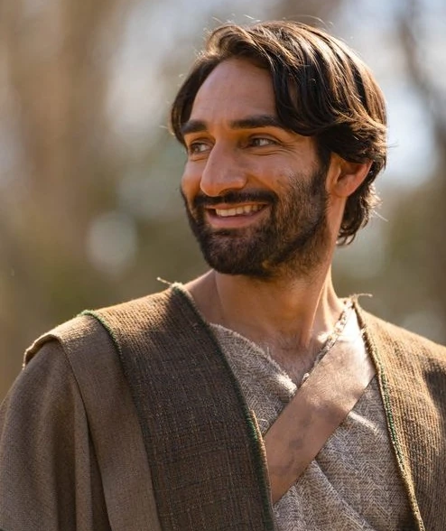
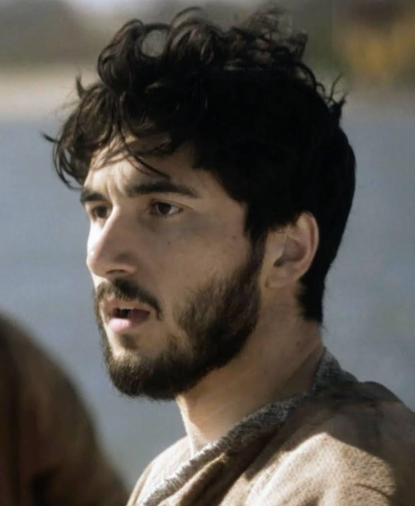
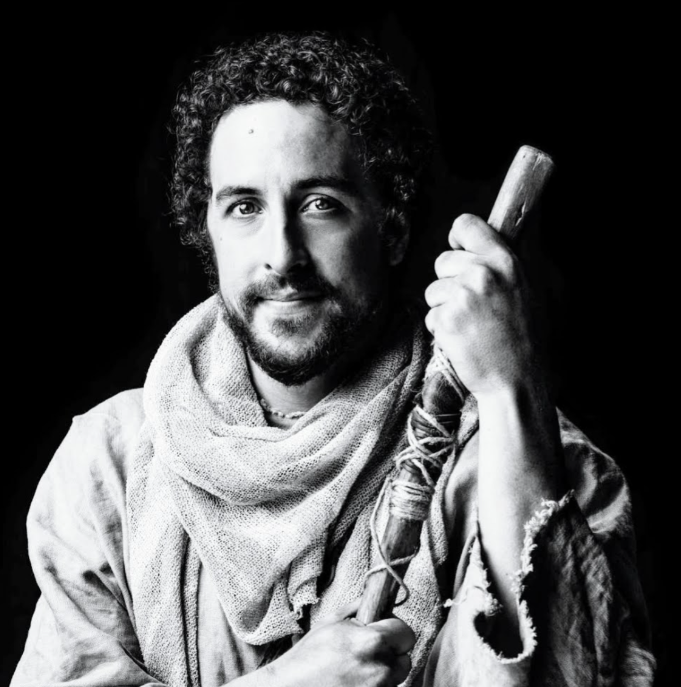
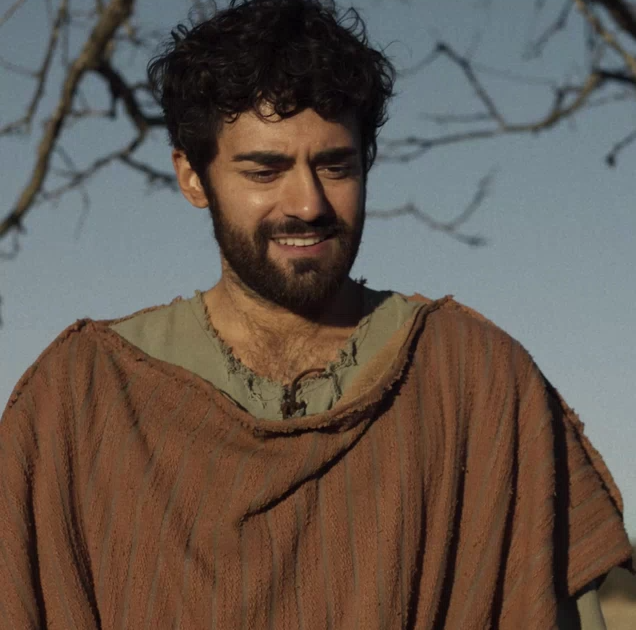
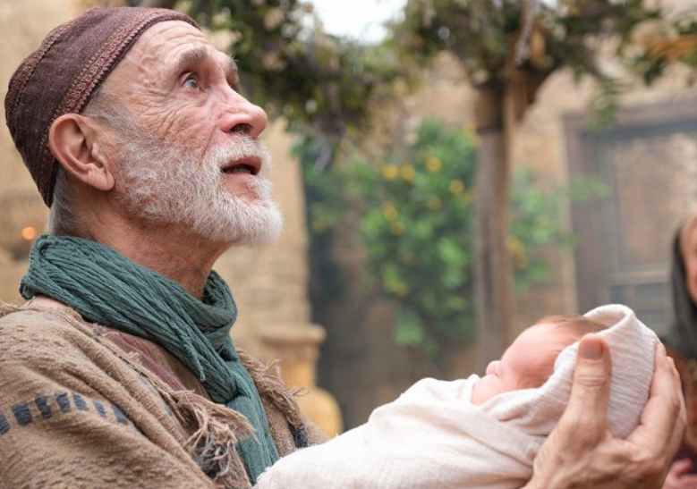

# The Chosen

### At a Glance

- [Overview](#overview)
- [Usage](#usage)
- [Season 1](#season-1)
- [Season 2](#season-2)
- [Season 3](#season-3)
- [Season 4](#season-4)
- [Characters](#characters)

## Overview

- **What is it?** ... _from [The Chosen](https://thechosen.tv/) site:_

  The Chosen is a historical drama based on the life of Jesus Christ,
  seen through the eyes of those who knew him. Set against the backdrop
  of Roman oppression in first-century Israel, the seven-season show
  shares an authentic and intimate look at Jesus’ revolutionary life and
  teachings.

  The Chosen is based on the true stories of the Gospels of Jesus
  Christ. Some locations and timelines have been combined or
  condensed. Backstories and some characters or dialog have been added.

  However, all the bible and historical context and any artistic
  imagination are designed to support the truth and intention of the
  Scriptures. Viewers are encouraged to read the scripture and the
  Gospels.

- **It's Free!**

  The Chosen uses a "crowdfunding" approach, so it's completely free
  to watch.  They utilize a "Pay it Forward" model, so you can
  contribute if you wish, offsetting some of their costs, keeping
  the show free.

  From the onset of Season 2, they will pre-release a new season in
  theaters for a short time.  After that, they will make the new
  season available through their free app.

- **Is it for me?**

  <!-- https://www.gotquestions.org/The-Chosen.html -->

  Watching **The Chosen** is a matter of conscience.  Some Christians
  appreciate the retelling of Jesus’ life, while others have
  difficulty with the artistic license involved with portraying Jesus’
  life on film _(and that's OK)_.

  I personally fall in the former camp.  This is not like any other
  "religious program" you have seen before.  It simply brings the
  biblical characters to life, and you realize they had many of the same
  experiences and struggles that we do today.

  I would encourage you to prayerfully discern whether watching the show
  will be a benefit or a hindrance to your walk with the Lord.

- **Why I created this page**

  This page was created to have a concise and consolidated set of links
  to the various _(somewhat disjointed)_ resources (i.e. the **streaming
  service**, **deep dives**, and **devotions**).
  
  Consistent with all **"Fire Within"** studies, you have the
  "completion status" check boxes - to help keep track of where you are
  at in the series.
  
- **Release Dates**
  
  - {{book.TCSeason1M}}: 04/21/2019
  - {{book.TCSeason2M}}: 04/04/2021
  - {{book.TCSeason3M}}: 11/05/2022
  - {{book.TCSeason4M}}: 06/02/2024
  - Season 5: _TBD_
  - Season 6: _TBD_
  - Season 7: _TBD_

## Usage

- **Install the Apps?**
  
  When you have installed the appropriate applications (i.e. "The
  Chosen App", or the "YouVersion Bible App"), the links below will be
  serviced by the app itself.  If you have NOT installed these apps,
  the links will be serviced by your browser.
  
  Either way works.  Typically it is recommended to install the apps
  _(it's really your preference)_.
  
- **Casting**
  
  Even though you are streaming an episode from your mobile device,
  you can cast it to your SmartTV, allowing everyone to enjoy it
  together.

  Here are some instructions that walk you through the process:
  [How to cast to your TV?](https://support.angel.com/hc/en-us/articles/4410287250327-How-to-cast-to-your-TV)
  
- **Descriptions**
  
  Descriptions have been compiled for both the series, and each
  episode.  However, because of limited space, these descriptions
  **are hidden by default**.
  
  You can toggle their display by simply clicking the **"Show
  Descriptions"** button (at the top of each series).
  
- **Deep Dives**

  Brandon and Vanessa Snipe are worship leaders that have a popular
  YouTube channel, where they discuss **The Chosen** in detail,
  bringing scripture into the discussion.  They started out with [The
  Snipe Life](https://www.youtube.com/@TheSnipeLife) which
  subsequently became [The Chosen
  Sleuth](https://www.youtube.com/@TheChosenSleuth) three years later.
  They have a ton of video content, which like many YouTube channels
  lack some organizational structure.

  The videos that discuss each Chosen episode have been linked
  directly in the episode guide (prefixed with `DD: {desc}`
  ... i.e. Deep Dive).
  
- **Devotions**
  
  The devotions listed here are provided by "The Chosen" team.
  
  There is not a devotion for every episode _(not quite sure why that
  is)_.  If an episode does not have a devotion, that slot is blank.
  
  The scripture references for each episode, come from the devotion.
  
  To Run a Devotion: **long-press** the `Devo-x` link, and click the
  "**open in browser**" option.
  
  - _Background:_
  
    Normally, you must subscribe to a Bible Reading Plan, in order to
    use it.  This allows the Bible App to track your progress.
    The devotion links, provided below, are generic - in that they do
    NOT contain any of your account subscription information.  This
    works when running in a browser, however, when clicked on a mobile
    device, it is serviced by your installed Bible App, and generates an
    error, stating: "**No reading plan content**".
  
    To work around this, simply **long-press** the `Devo-x` link, and
    click the "**open in browser**" option.

## Season 1 

P{ inject('
') }P

Season 1 is set in 1st century Galilee, where Jesus starts to build a
group for his ministry, inviting several people with different
backgrounds.

As he performs his first miracles, Jesus calls the redeemed woman Mary
Magdalene; the stonemason Thaddeus; the choir member Little James; the
fishermen Simon, Andrew, Big James, and John; the caterer Thomas and
vintner Ramah; and the tax collector Matthew to follow him.

As the group travels through Samaria and following his meeting with
Nicodemus, Jesus launches his public ministry after revealing himself
to Photina, a Samaritan woman.

P{ inject('
') }P

> Bible App (Season 1 Released 04/21/2019) ... 
> [Movies](https://www.bible.com/videos/collections/208-the-chosen-season-1) • 
> [Devotions](https://www.bible.com/reading-plans/41622-the-chosen-bibleproject-season-1-reading-plan)
> <button data-fw-desc-toggle onclick="fw.toggleDesc()">Show Descriptions</button> _... both Series & Episodes_

M{ sermonSeries({
  entries: [
    {
      id:                 `TC-S1-E1`, 
      sermon:             `https://watch.thechosen.tv/video/184683594334@@I Have Called You By Name`,
//    extraSermonLink:    `https://www.bible.com/videos/41889-101-i-have-called-you-by-name@@&nbsp;&nbsp;<i>Alt Stream (Bible App)</i>`,
      desc:               `Two brothers struggle with their tax debts to Rome while a woman in the Red Quarter wrestles with her demons.`,
      scripture:          `isa.43.1@@Isaiah 43:1##isa.42.1-3@@CR:Isaiah 42:1-3##mat.18.12-14@@CR:Matthew 18:12-14##luk.8.2@@CR:Luke 8:2`,
      studyGuide:         `https://bible.com/reading-plans/41622-the-chosen-bibleproject-season-1-reading-plan/day/1@@Devo-1`,
      date:               `DeepDive:yCafoz6lKwg@@Nicodemus##VdUPmi7vl8I@@Mary Magdalene##7bMaiOwYjhg@@Simon/Andrew/Eden##jfHlTrTgc4w@@Character Guide`,
    },
    {
      id:                 `TC-S1-E2`, 
      sermon:             `https://watch.thechosen.tv/video/184683594335@@Shabbat`,
//    extraSermonLink:    `https://www.bible.com/videos/41890-102-shabbat@@&nbsp;&nbsp;<i>Alt Stream (Bible App)</i>`,
      desc:               `Matthew validates Simon's claims with Praetor Quintus, Nicodemus investigates the miracle reported in the Red Quarter, and Mary receives surprise guests at her Shabbat dinner.`,
      scripture:          `jhn.9.1-6@@John 9:1-6##jhn.9.18-25@@CR:John 9:18-25##mat.11.28-29@@CR:Matthew 11:28-29`,
      studyGuide:         `https://bible.com/reading-plans/41622-the-chosen-bibleproject-season-1-reading-plan/day/2@@Devo-2`,
      date:               `DeepDive:kZyrhFdNuJw@@Shabbat##H37YA8LyCLE@@Eden##NTqiBcJ62NU@@Sanhedrin`,
    },
    {
      id:                 `TC-S1-E3`, 
      sermon:             `https://watch.thechosen.tv/video/184683594336@@Jesus Loves The Little Children`,
//    extraSermonLink:    `https://www.bible.com/videos/41891-103-jesus-loves-the-little-children@@&nbsp;&nbsp;<i>Alt Stream (Bible App)</i>`,
      desc:               `Jesus befriends and teaches the group of children who discover His camp on the outskirts of Capernaum.`,
      scripture:          `mat.5.43-45@@Matthew 5:43-45##mat.18.1-5@@CR:Matthew 18:1-5##mat.19.13-14@@CR:Matthew 19:13-14`,
      studyGuide:         `https://bible.com/reading-plans/41622-the-chosen-bibleproject-season-1-reading-plan/day/3@@Devo-3`,
      date:               `DeepDive:_O7U3Pn_kMA@@Jesus' Humanity`,
    },
    {
      id:                 `TC-S1-E4`, 
      sermon:             `https://watch.thechosen.tv/video/184683594337@@The Rock On Which It Is Built`,
//    extraSermonLink:    `https://www.bible.com/videos/41893-104-the-rock-on-which-it-is-built@@&nbsp;&nbsp;<i>Alt Stream (Bible App)</i>`,
      desc:               `With his life and family under threat from Rome, Simon spends one last night fishing in a desperate attempt to square his debts. Andrew spots a familiar face waiting for them on the shores of Galilee.`,
      scripture:          `luk.5.1-11@@Luke 5:1-11##eph.2.4-8@@CR:Ephesians 2:4-8`,
      studyGuide:         `https://bible.com/reading-plans/41622-the-chosen-bibleproject-season-1-reading-plan/day/4@@Devo-4`,
      date:               `DeepDive:1mHmfkCEl0M@@Fish & Brothers##lbsJ19B3lWM@@Simon's Marriage`,
    },
    {                     // NO Devotion for this episode
      id:                 `TC-S1-E5`, 
      sermon:             `https://watch.thechosen.tv/video/184683594338@@The Wedding Gift`,
//    extraSermonLink:    `https://www.bible.com/videos/41896-105-the-wedding-gift@@&nbsp;&nbsp;<i>Alt Stream (Bible App)</i>`,
      desc:               `Nicodemus interrogates John the Baptizer while Jesus and his students make their way to a wedding celebration in Cana. When the wine runs low, Mary asks her son to intervene on behalf of the bridegroom's family.`,
//    scripture:          `UNKNOWN ... NO Devotion to glean info from`,
      studyGuide:         `NONE`,
      date:               `DeepDive:oH2XU-QZJeE@@John the Baptist##Xq-ugp-u2Ks@@Simon's Calling`,
    },
    {
      id:                 `TC-S1-E6`, 
      sermon:             `https://watch.thechosen.tv/video/184683594339@@Indescribable Compassion`,
//    extraSermonLink:    `https://www.bible.com/videos/41895-106-indescribable-compassion@@&nbsp;&nbsp;<i>Alt Stream (Bible App)</i>`,
      desc:               `After witnessing the healing of a leper on the road to Capernaum, a woman forces her paralytic friend through the crowd to meet Jesus.`,
      scripture:          `mrk.2.1-12@@Mark 2:1-12##rom.13.8-10@@CR:Romans 13:8-10`,
      studyGuide:         `https://bible.com/reading-plans/41622-the-chosen-bibleproject-season-1-reading-plan/day/5@@Devo-5`,
      date:               `DeepDive:r3jcFfSL58s@@Matthew/Nicodemus/Tamar##kskQBLoZEuE@@Nicodemus/Shmuel##e-cXGiVU2rw@@Tamar`,
    },
    {
      id:                 `TC-S1-E7`, 
      sermon:             `https://watch.thechosen.tv/video/184683594340@@Invitations`,
//    extraSermonLink:    `https://www.bible.com/videos/41897-107-invitations@@&nbsp;&nbsp;<i>Alt Stream (Bible App)</i>`,
      desc:               `Matthew struggles to reconcile the miracles he has witnessed with reality. Nicodemus meets with Jesus by night.`,
      scripture:          `jhn.3.1-17@@John 3:1-17`,
      studyGuide:         `https://bible.com/reading-plans/41622-the-chosen-bibleproject-season-1-reading-plan/day/6@@Devo-6`,
      date:               `DeepDive:647-s2nPDYA@@Matthew Follows Jesus`,
    },
    {
      id:                 `TC-S1-E8`, 
      sermon:             `https://watch.thechosen.tv/video/184683594341@@I Am He`,
//    extraSermonLink:    `https://www.bible.com/videos/41898-108-i-am-he@@&nbsp;&nbsp;<i>Alt Stream (Bible App)</i>`,
      desc:               `Jesus and His students complete their preparations and leave Capernaum for Samaria. Jesus meets with a suffering woman at Jacob's Well and announces that He is the Messiah.`,
//    scripture: TRASH    `gen.33.18-20@@Genesis 33:18-20##mrk.2.13-17@@CR:Mark 2:13-17##mat.9.9-13@@CR:Matthew 9:9-13##jhn.4.1-42@@CR:John 4:1-42`,
      scripture:          `jhn.4.4-26@@John 4:4-26##jhn.4.39-42@@CR:John 4:39-42`,
      studyGuide:         `https://bible.com/reading-plans/41622-the-chosen-bibleproject-season-1-reading-plan/day/7@@Devo-7`,
      date:               `DeepDive:FXV381GrlME@@Woman at the Well`,
    },
  ]
}) }M

## Season 2

P{ inject('
') }P

Beginning in Samaria, Season 2 moves into nearby regions such as Syria
and Judea, where Jesus continues to build his group of students.

As He continues to perform miracles while preparing for an important
sermon, Jesus additionally calls John the Baptizer's disciple Philip,
the architect Nathanael, and the Zealot Simon Z.

As word of Jesus continues to spread throughout the region, He
encounters both opportunities and difficulties.

The season culminates with preparations being made for the Sermon on
the Mount, with the help of the business apprentice Judas Iscariot.

P{ inject('
') }P

> Bible App (Season 2 Released 04/04/2021) ... 
> [Movies](https://www.bible.com/videos/collections/1389-the-chosen-season-2) • 
> [Devotions](https://www.bible.com/reading-plans/41623-the-chosen-bibleproject-season-2-reading-plan)
> <button data-fw-desc-toggle onclick="fw.toggleDesc()">Show Descriptions</button> _... both Series & Episodes_

M{ sermonSeries({
  entries: [
    {
      id:                 `TC-S2-E1`, 
      sermon:             `https://watch.thechosen.tv/video/184683594353@@Thunder`,
//    extraSermonLink:    `https://www.bible.com/videos/41880-201-thunder@@&nbsp;&nbsp;<i>Alt Stream (Bible App)</i>`,
      desc:               `Tension builds among the disciples as they wrestle with the increasing fame of Jesus in Samaria. Jesus rebukes Big James and John for their prejudice and, after a near-violent encounter, gives them a new nickname.`,
      scripture:          `php.2.3-11@@Philippians 2:3-11##luk.23.34@@CR:Luke 23:34`,
      studyGuide:         `https://www.bible.com/reading-plans/41623-the-chosen-bibleproject-season-2-reading-plan/day/1@@Devo-1`,
      date:               `DeepDive:FpQB_3ImScU@@Bad Samaritan (Malek)##Rqn2lTl4sy4@@John`,
    },
    {
      id:                 `TC-S2-E2`, 
      sermon:             `https://watch.thechosen.tv/video/184683594354@@I Saw You`,
//    extraSermonLink:    `https://www.bible.com/videos/41881-202-i-saw-you@@&nbsp;&nbsp;<i>Alt Stream (Bible App)</i>`,
      desc:               `A mysterious visitor seeks to meet Jesus, but the disciples are hesitant. Tension builds between Simon and Matthew. As the group heads to a new city, word arrives that Jesus' fame is growing.`,
      scripture:          `psa.102@@Psalms 102##jhn.1.43-51@@CR:John 1:43-51`,
      studyGuide:         `https://www.bible.com/reading-plans/41623-the-chosen-bibleproject-season-2-reading-plan/day/2@@Devo-2`,
      date:               `DeepDive:wCTiw8KhpxE@@Nathanael##24zp4deYk0A@@Phillip/Matthew`,
    },
    {                     // NO Devotion for this episode
      id:                 `TC-S2-E3`, 
      sermon:             `https://watch.thechosen.tv/video/184683594355@@Matthew 4:24`,
//    extraSermonLink:    `https://www.bible.com/videos/41882-203-matthew-4-24@@&nbsp;&nbsp;<i>Alt Stream (Bible App)</i>`,
      desc:               `A long, exhausting day turns into night as the disciples help Jesus deal with a large crowd hoping to be healed. Around the campfire, over dinner, the group tried to get to know each other better. But tensions erupt.`,
      scripture:          `mat.4.24@@Matthew 4:24`,
      studyGuide:         `NONE`,
      date:               `DeepDive:LEZElYsFb3k@@Mary/Jesus##ZS8GLzyAWIY@@Rundown##cN8J4p37k04@@Disdain for Matthew`,
    },
    {
      id:                 `TC-S2-E4`, 
      sermon:             `https://watch.thechosen.tv/video/184683594356@@The Perfect Opportunity`,
//    extraSermonLink:    `https://www.bible.com/videos/41883-204-the-perfect-opportunity@@&nbsp;&nbsp;<i>Alt Stream (Bible App)</i>`,
      desc:               `As Jesus and the disciples head to Jerusalem to celebrate the Feast of Tabernacles, a new enemy follows them, while a familiar enemy awaits.`,
      scripture:          `jhn.5.1-18@@John 5:1-18`,
      studyGuide:         `https://www.bible.com/reading-plans/41623-the-chosen-bibleproject-season-2-reading-plan/day/3@@Devo-3`,
      date:               `DeepDive:Re5viFQG8sA@@Rundown##Een00ofHr4w@@Simon the Zealot`,
    },
    {
      id:                 `TC-S2-E5`, 
      sermon:             `https://watch.thechosen.tv/video/184683594357@@Spirit`,
//    extraSermonLink:    `https://www.bible.com/videos/41884-205-spirit@@&nbsp;&nbsp;<i>Alt Stream (Bible App)</i>`,
      desc:               `After stirring the water, Jesus is now pursued by Simon the Zealot, Atticus, and Shmuel. John the Baptizer visits the group and tells Jesus his dangerous mission. Meanwhile, back at the camp, Mary Magdalene is devastated by an encounter with a mysterious and dangerous stranger.`,
      scripture:          `luk.11.14@@Luke 11:14##mrk.1.32-34@@CR:Mark 1:32-34##luk.8.26-34@@CR:Luke 8:26-34##mat.9.32-33@@CR:Matthew 9:32-33##jhn.14.12@@CR:John 14:12`,
      studyGuide:         `https://www.bible.com/reading-plans/41623-the-chosen-bibleproject-season-2-reading-plan/day/4@@Devo-4`,
      date:               `DeepDive:KLcsELrv8uQ@@Rundown##QGGz6qJMFCM@@Mary Magdalene's Relapse##sUXuVBD1Fag@@Pharisees Yani & Shmuel`,
    },
    {
      id:                 `TC-S2-E6`, 
      sermon:             `https://watch.thechosen.tv/video/184683594358@@Unlawful`,
//    extraSermonLink:    `https://www.bible.com/videos/41885-206-unlawful@@&nbsp;&nbsp;<i>Alt Stream (Bible App)</i>`,
      desc:               `Matthew and Simon try to get along as they search for Mary in dark places. The group fears for Mary as they struggle with lack of food and bad news about John the Baptist. Meanwhile, Jesus continues to upset Pharisees across multiple regions.`,
//    scripture:          `UNKNOWN ... NO Devotion to glean info from`,
      studyGuide:         `NONE`,
      date:               `DeepDive:BAct64ljpE8@@Rundown##Xq6NjOfIUOE@@Mary Magdalene's Journey##xdYM7Pqs54Q@@Character Development`,
    },
    {
      id:                 `TC-S2-E7`, 
      sermon:             `https://watch.thechosen.tv/video/184683594359@@Reckoning`,
//    extraSermonLink:    `https://www.bible.com/videos/41886-207-reckoning@@&nbsp;&nbsp;<i>Alt Stream (Bible App)</i>`,
      desc:               `After learning of Jesus' whereabouts, Quintus sends Gaius to arrest him. The disciples lose control as they argue about how to respond. While seeking information about where Jesus has been taken, Andrew and Philip encounter old friends.`,
      scripture:          `mat.6.5-14@@Matthew 6:5-14`,
      studyGuide:         `https://www.bible.com/reading-plans/41623-the-chosen-bibleproject-season-2-reading-plan/day/5@@Devo-5`,
      date:               `DeepDive:6svSVb_bwrg@@Rundown##jhGfu5CgwPM@@Jesus Interactions##D7ja5V2nPrc@@Andrew's Anger##lSfhgbXZWnE@@Roman System`,
    },
    {
      id:                 `TC-S2-E8`, 
      sermon:             `https://watch.thechosen.tv/video/184683594360@@Beyond Mountains`,
//    extraSermonLink:    `https://www.bible.com/videos/41887-208-beyond-mountains@@&nbsp;&nbsp;<i>Alt Stream (Bible App)</i>`,
      desc:               `While Jesus and Matthew prepare the content of the big sermon, the disciples spread the word while fighting amongst themselves. A high-ranking Sanhedrin member is shocked by Shmuel's reports on Jesus. Thousands arrive for the sermon, including familiar faces.`,
      scripture:          `mat.5.1-16@@Matthew 5:1-16##1pe.2.11-12@@CR:1 Peter 2:11-12`,
      studyGuide:         `https://www.bible.com/reading-plans/41623-the-chosen-bibleproject-season-2-reading-plan/day/6@@Devo-6`,
      date:               `DeepDive:pawP8xz3lpY@@Sermon Prep##C6LlmyQHZ64@@Judas##aS-daWezmGk@@Pharisees Plans`,
    },
  ]
}) }M

## Season 3

P{ inject('
') }P

“Come to me, you who are weary and heavy-laden, and I will give you
rest.” 
Season 3 picks up where Season 2 left off, with Jesus delivering
the most famous sermon in history.
What follows are the consequences of living out his teachings. The
world changes because of this sermon, and the believers in (and
enemies of) Jesus increase exponentially. 

Following the Sermon on the Mount, Jesus sends his twelve apostles,
two by two, to preach and perform miracles without him, leading to the
disciples facing their biggest challenge yet.

Jesus then returns to his hometown, Nazareth, which results in a shift
to his ministry at the year of his popularity.

At the climactic end of the season in the Decapolis and at the Sea of
Galilee, Jesus feeds thousands with loaves and fishes and then walks
on the water.

P{ inject('
') }P

> Bible App (Season 3 Released 11/05/2022) ... 
> [Movies](https://www.bible.com/videos/collections/1393-the-chosen-season-3) • 
> [Devotions](https://www.bible.com/reading-plans/41624-the-chosen-bibleproject-season-3-reading-plan)
> <button data-fw-desc-toggle onclick="fw.toggleDesc()">Show Descriptions</button> _... both Series & Episodes_

M{ sermonSeries({
  entries: [
    {
      id:                 `TC-S3-E1`, 
      sermon:             `https://watch.thechosen.tv/video/184683594324@@Homecoming`,
//    extraSermonLink:    `https://www.bible.com/videos/42359-301-homecoming?collection=1393@@&nbsp;&nbsp;<i>Alt Stream (Bible App)</i>`,
      desc:               `Jesus delivers the most life-altering sermon in history. The result? More followers, more enemies, and disciples ready to follow Jesus anywhere. Simon and Eden reunite, Matthew faces his past, and Andrew visits John the Baptist in prison.`,
      scripture:          `mat.6.25-34@@Matthew 6:25-34`,
      studyGuide:         `https://www.bible.com/reading-plans/41624-the-chosen-bibleproject-season-3-reading-plan/day/1@@Devo-1`,
      date:               `DeepDive:BUsDbiTsZB8@@Judas##Bs7jkuLHsFM@@Relationships##to0Yy1pH5Rs@@Andrew's Anxiety##zOQwSoI_CFY@@Sermon on the Mount##VuupQ9Yl_1w@@Matthew`,
    },
    {
      id:                 `TC-S3-E2`, 
      sermon:             `https://watch.thechosen.tv/video/184683594325@@Two by Two`,
//    extraSermonLink:    `https://www.bible.com/videos/42360-302-two-by-two?collection=1393@@&nbsp;&nbsp;<i>Alt Stream (Bible App)</i>`,
      desc:               `Jesus is a problem for the Romans. With pilgrims from everywhere setting up a tent city at the gates of Capernaum to see Jesus, tensions rise. Jesus officially sends the twelve apostles on an exciting but dangerous mission, causing Little James to ask why he hasn’t been healed.`,
      scripture:          `psa.133@@Psalms 133##mat.5.23-26@@CR:Matthew 5:23-26`,
      studyGuide:         `https://www.bible.com/reading-plans/41624-the-chosen-bibleproject-season-3-reading-plan/day/2@@Devo-2`,
      date:               `DeepDive:I6bHYv-rjJA@@Gaius & Atticus##N9vena-l1-A@@Simon the Zealot##TvEPLhZoxCY@@Simon & Eden##5eUGWPVm8GQ@@Thomas & Ramah##bMFmBl3E2_0@@Made Me Cry##JNchqQOCZcs@@Two by Two`,
    },
    {
      id:                 `TC-S3-E3`, 
      sermon:             `https://watch.thechosen.tv/video/184683594326@@Physician, Heal Yourself`,
//    extraSermonLink:    `https://www.bible.com/videos/42361-303-physician-heal-yourself?collection=1393@@&nbsp;&nbsp;<i>Alt Stream (Bible App)</i>`,
      desc:               `Jesus returns to his childhood home for the big Jewish new year celebration. His childhood friends and family are all buzzing with what they’ve heard about Jesus…until he tells them the truth of who He is.`,
      scripture:          `isa.61.1-2@@Isaiah 61:1-2##luk.4.14-30@@CR:Luke 4:14-30`,
      studyGuide:         `https://www.bible.com/reading-plans/41624-the-chosen-bibleproject-season-3-reading-plan/day/3@@Devo-3`,
      date:               `DeepDive:am7oPVQF_rg@@Rundown##Apf2ucbxfAk@@Rosh Hashanah##BxwNYdqiMrk@@Non-Biblical Bridle##7JhhIr2H4B0@@Synagogue Scene`,
    },
    {                     // NO Devotion for this episode
      id:                 `TC-S3-E4`, 
      sermon:             `https://watch.thechosen.tv/video/184683594327@@Clean, Part 1`,
//    extraSermonLink:    `https://www.bible.com/videos/42362-304-clean-part-1?collection=1393@@&nbsp;&nbsp;<i>Alt Stream (Bible App)</i>`,
      desc:               `Two by two, the disciples carry out Jesus’ mission to heal, cast out demons, and preach his words. But upon returning, they struggle with understanding what happened while Simon and Eden struggle to reconnect.`,
//    scripture:          `UNKNOWN ... NO Devotion to glean info from`,
      studyGuide:         `NONE`,
      date:               `DeepDive:dqPj7FUebZw@@Simon & Eden##L8zIP7kbNyQ@@Two by Two##_MCcjbb4jZw@@Tamar & Mary##MwEDZ-bv5h0@@Apostle Power Danger##LsUNKIgS9rg@@Pharisees Return`,
    },
    {
      id:                 `TC-S3-E5`, 
      sermon:             `https://watch.thechosen.tv/video/184683594328@@Clean, Part 2`,
//    extraSermonLink:    `https://www.bible.com/videos/42368-305-clean-part-2?collection=1393@@&nbsp;&nbsp;<i>Alt Stream (Bible App)</i>`,
      desc:               `As tensions mount at home, Simon and Gaius work together to fix the water problem in Capernaum. Meanwhile, Jairus and Veronica are equally desperate to find Jesus as the only hope for their crises.`,
      scripture:          `mrk.5.24-34@@Mark 5:24-34##jas.2.1-9@@CR:James 2:1-9##jas.2.12-13@@CR:James 2:12-13`,
      studyGuide:         `https://www.bible.com/reading-plans/41624-the-chosen-bibleproject-season-3-reading-plan/day/4@@Devo-4`,
      date:               `DeepDive:507iY16UH1M@@Eden's Journey##i3kXi8DJ1x0@@Jairus##4fdbvf0sUnQ@@Bleeding Woman`,
    },
    {
      id:                 `TC-S3-E6`, 
      sermon:             `https://watch.thechosen.tv/video/184683594331@@Intensity in Tent City`,
//    extraSermonLink:    `https://www.bible.com/videos/42369-306-intensity-in-tent-city?collection=1393@@&nbsp;&nbsp;<i>Alt Stream (Bible App)</i>`,
      desc:               `Andrew and Philip discover their previous mission resulted in devastation that will require a return. Simon Z is finally forced to confront his past, but then two disciples of John the Baptist come to Capernaum with an important question for Jesus.`,
      scripture:          `mat.11.2-19@@Matthew 11:2-19`,
      studyGuide:         `https://www.bible.com/reading-plans/41624-the-chosen-bibleproject-season-3-reading-plan/day/5@@Devo-5`,
      date:               `DeepDive:PMTexT3wNko@@Leander NOT Matthias##L3sQu6S8APc@@John the Baptist##8xXRKBjs2Tc@@What did Mary Magdalene see##cKgE7ycVlW4@@Simon the Zealot##9HD243-KErE@@Simon & Eden##6kffWBA2Keg@@Gaius##CgFkSEGhTn8@@Barnaby and Shula##y4CEUaEW5DI@@Mary & Tamar##x4QwjO0HF8k@@Disciples Sharping Weapons`,
    },
    {                     // NO Devotion for this episode
      id:                 `TC-S3-E7`, 
      sermon:             `https://watch.thechosen.tv/video/184683594333@@Ears to Hear`,
//    extraSermonLink:    `https://www.bible.com/videos/42371-307-ears-to-hear?collection=1393@@&nbsp;&nbsp;<i>Alt Stream (Bible App)</i>`,
      desc:               `Andrew and Philip return from their trip with desperate news: they need Jesus’ help to solve a huge crisis in the Decapolis. Jesus leads them on a trip to the dangerous region, where they face opposition from all sides. Literally. Meanwhile, John is assigned to bring an angry Simon to Jesus.`,
//    scripture:          `UNKNOWN ... NO Devotion to glean info from`,
      studyGuide:         `NONE`,
      date:               `DeepDive:SJWZqX4GZzI@@Andrew & Phillip##kWI6-HsLPvw@@Matthew's Restoration##YFIejQojHOo@@Kafni Rejects Thomas##7-PDrY-AmJs@@Gaius Seeks, Simon Runs##oyQ6n7EXUck@@John's Ego, Simon's Suffering`,
    },
    {
      id:                 `TC-S3-E8`, 
      sermon:             `https://watch.thechosen.tv/video/184683594332@@Sustenance`,
//    extraSermonLink:    `https://www.bible.com/videos/42372-308-sustenance?collection=1393@@&nbsp;&nbsp;<i>Alt Stream (Bible App)</i>`,
      desc:               `Thousands arrive to first argue with, then listen to Jesus as he preaches. Shmuel and Atticus hear what’s happening and journey towards the Decapolis to catch Jesus in the act of a possible revolt. Meanwhile, as the preaching extends to the next day, the disciples realize they have a significant problem: the thousands are hungry, and there’s no food.`,
      scripture:          `mat.14.22-36@@Matthew 14:22-36##col.3.1-3@@CR:Colossians 3:1-3`,
      studyGuide:         `https://www.bible.com/reading-plans/41624-the-chosen-bibleproject-season-3-reading-plan/day/6@@Devo-6`,
      date:               `DeepDive:8_Ar5QGtq0c@@King David Cameo##pfEUJ1N-aVk@@Feeding 5000##E5CJzKhX4T4@@Simon's Weakness##VTjL9euDlvc@@Shmuel##Wnaz205S04M@@Feeding 5000 Miracle##R6oQyFFZVsI@@Eden's Mask Breaks##cXgNiD9fR5s@@Parable of the Two Sons##a1m7ODwVWlA@@Season 3 Thoughts`,
    },
  ]
}) }M

## Season 4

<mark><b>Please NOTE:</b></mark> Season 4 requires you to **sign-in** to stream the episodes _(it's a free account)_.

P{ inject('
') }P

<!-- Description found here: https://www.thechosenriseup.com/  -->

Clashing kingdoms. Rival rulers. The enemies of Jesus close in while
His followers struggle to keep up, leaving him to carry the burden
alone.

Threatened by the reality of Jesus’ growing influence, religious
leaders do the unthinkable — ally with their Roman oppressors. As the
seeds of betrayal are planted and opposition to Jesus’ message turns
violent, he’s left with no alternative but demand his followers RISE
UP.

P{ inject('
') }P

> Bible App (Season 4 Released 06/02/2024) ... 
> [Movies](https://watch.thechosen.tv/page/season%204) • 
> [Devotions](https://www.bible.com/reading-plans/47980-the-chosen-bible-project-season-4-reading-plan)
> <button data-fw-desc-toggle onclick="fw.toggleDesc()">Show Descriptions</button> _... both Series & Episodes_

M{ sermonSeries({
  entries: [
    {
      id:                 `TC-S4-E1`, 
      sermon:             `https://watch.thechosen.tv/video/184683596182@@Promises`,
//    extraSermonLink:    `Season 4 DOES NOT appear to be available on YouVersion :-(`,
      desc:               `An intoxicating dance leads Herod to put an end to John the Baptizer, but no one can stop what—or Who—he’s ushered in.`,
      scripture:          `luk.1.39-45@@Luke 1:39-45##luk.1.57-66@@CR:Luke 1:57-66##isa.40.3-8@@CR:Isaiah 40:3-8`,
      studyGuide:         `https://www.bible.com/reading-plans/47980-the-chosen-bible-project-season-4-reading-plan/day/1@@Devo-1`,
      date:               `DeepDive:YkWva_okb_M@@John the Baptist##uzy4NxkSQCc@@Simon the Zealot & Judas##ybI4fGcUxh0@@Thomas & Ramah`,
    },
    {
      id:                 `TC-S4-E2`, 
      sermon:             `https://watch.thechosen.tv/video/184683596183@@Confessions`,
//    extraSermonLink:    `Season 4 DOES NOT appear to be available on YouVersion :-(`,
      desc:               `Jesus founds his church on unholy ground and Simon goes public with Jesus’ true identity, getting a new name in the process. But can the new “Peter” forgive old wrongs?`,
      scripture:          `mrk.8.27-30@@Mark 8:27-30##mat.16.13-20@@CR:Matthew 16:13-20`,
      studyGuide:         `https://www.bible.com/reading-plans/47980-the-chosen-bible-project-season-4-reading-plan/day/2@@Devo-2`,
      date:               `DeepDive:4NnIQ8e19sY@@Simon Renamed to Peter##g96DCXOHBN8@@Thomas & Ramah##_uxI6xyuZEM@@Matthew & Peter`,
    },
    {
      id:                 `TC-S4-E3`, 
      sermon:             `https://watch.thechosen.tv/video/184683596185@@Moon to Blood`,
//    extraSermonLink:    `Season 4 DOES NOT appear to be available on YouVersion :-(`,
      desc:               `When Jesus heals a blind man on the Sabbath, religious leaders confront him, drawing a riotous crowd. Gaius defies a direct order leading Quintus to take matters—and someone’s life—into his own hands.`,
      scripture:          `mat.7.7-11@@Matthew 7:7-11##mat.20.20-28@@CR:Matthew 20:20-28##jhn.15.7-8@@CR:John 15:7-8`,
      studyGuide:         `https://www.bible.com/reading-plans/47980-the-chosen-bible-project-season-4-reading-plan/day/3@@Devo-3`,
      date:               `DeepDive:RgNnSNz9kiM@@Ramah's Death##W2bPFfNiXRQ@@Blind Man Healed##mHPQAUPukqM@@King David Prays/Fasts##3lK1E-zFSO4@@Sign of the Son of Man`,
    },
    {
      id:                 `TC-S4-E4`, 
      sermon:             `https://watch.thechosen.tv/video/184683596186@@Calm Before`,
//    extraSermonLink:    `Season 4 DOES NOT appear to be available on YouVersion :-(`,
      desc:               `Beginning with a funeral procession, time marches rapidly toward the final days of Jesus’ ministry. While the disciples seek status for themselves, a Roman ruler comes with a humble request.`,
      scripture:          `mat.5.38-42@@Matthew 5:38-42##1jn.4.15-19@@CR:1 John 4:15-19`,
      studyGuide:         `https://www.bible.com/reading-plans/47980-the-chosen-bible-project-season-4-reading-plan/day/4@@Devo-4`,
      date:               `DeepDive:-puzmAYQ9wA@@The Truth about Ramah##TIyWqFvOeYM@@James & John (Left & Right)`,
    },
    {
      id:                 `TC-S4-E5`, 
      sermon:             `https://watch.thechosen.tv/video/184683596187@@Sitting, Serving, Scheming`,
//    extraSermonLink:    `Season 4 DOES NOT appear to be available on YouVersion :-(`,
      desc:               `Roman soldiers demand the disciples carry their armor, but Jesus goes one step farther. Frustrated by the direction of Jesus’ ministry, Judas visits an old friend for advice.`,
      scripture:          `jhn.10.1-21@@John 10:1-21`,
      studyGuide:         `https://www.bible.com/reading-plans/47980-the-chosen-bible-project-season-4-reading-plan/day/5@@Devo-5`,
      date:               `DeepDive:iZnRqwgiGAY@@Sanhedrin##U3jMs2e6t-k@@Romans Mistreat Jesus##X_AJqvs25pQ@@Judas##ErkLP0Lneks@@Mary & Martha`,
    },
    {
      id:                 `TC-S4-E6`, 
      sermon:             `https://watch.thechosen.tv/video/184683596188@@Dedication`,
//    extraSermonLink:    `Season 4 DOES NOT appear to be available on YouVersion :-(`,
      desc:               `Jesus and the disciples celebrate Hanukkah. Matthew confronts Judas about irregularities, and the festival turns into a fight, then flight. The disciples escape with their lives, but learn a friend hasn’t been so lucky.`,
      scripture:          `jhn.11.1-4@@John 11:1-4##jhn.11.17-27@@CR:John 11:17-27##jhn.11.32-44@@CR:John 11:32-44`,
      studyGuide:         `https://www.bible.com/reading-plans/47980-the-chosen-bible-project-season-4-reading-plan/day/6@@Devo-6`,
      date:               `DeepDive:COKS24Gaw-A@@John 10##RfFPJqtHglw@@Judas - No Turning Back##bf-e13k7I4g@@Hanukkah Explained`,
    },
    {
      id:                 `TC-S4-E7`, 
      sermon:             `https://watch.thechosen.tv/video/184683596184@@The Last Sign`,
//    extraSermonLink:    `Season 4 DOES NOT appear to be available on YouVersion :-(`,
      desc:               `Jesus brings Lazarus back to life—and sets off the chain of events that will lead to His own death.`,
      scripture:          `mic.6.8-9@@Micah 6:8-9##mat.25.31-40@@CR:Matthew 25:31-40`,
      studyGuide:         `https://www.bible.com/reading-plans/47980-the-chosen-bible-project-season-4-reading-plan/day/7@@Devo-7`,
      date:               `DeepDive:0ae91iU-tHw@@Flash Forward##L54X-WnpfHI@@The Apostles##fz1CGbY1qmM@@Lazarus' Resurrection##MtZhwS_7XCY@@Mystery Man##PXzUL79DAEM@@Reactopms tp Lazarus`,
    },
    {                     // NO Devotion for this episode
      id:                 `TC-S4-E8`, 
      sermon:             `https://watch.thechosen.tv/video/184683596189@@Humble`,
//    extraSermonLink:    `Season 4 DOES NOT appear to be available on YouVersion :-(`,
      desc:               `Jesus refuses to look and act like the Messiah everyone expects—arriving like a lamb instead of a lion and riding a donkey instead of a war horse.`,
//    scripture:          `UNKNOWN ... NO Devotion to glean info from`,
      studyGuide:         `NONE`,
      date:               `DeepDive:1Q9iCKEM4C0@@Shmuel's Story##9H6E5qCi6Po@@The Watcher (Mystery Man)##vj44U_-bsMA@@Misc Points##DU7wgqVqkJo@@Experts Break Down Season 4`,
    },
  ]
}) }M

## Characters

With so many characters in The Chosen, it’s easy to lose track. This
visual guide highlights the key players to help you follow along with
the unfolding story.

- [Jesus](#jesus)
- [The Twelve Apostles](#the-twelve-apostles)
- [The Women In Jesus's Ministry](#the-women-in-jesuss-ministry)
- [Jesus's Family](#jesuss-family)
- [Jesus's Friends](#jesuss-friends)
- [Religious Leaders](#religious-leaders)
- [The Romans and Herodians](#the-romans-and-herodians)
- [Miracle Recipients](#miracle-recipients)

**Visual Guide** – Use these images to visually identify each
character, then click to explore their story and role in the series.

  <a class="char-thumbnail" href="#jesus">
    
    
Jesus

  </a>

  <a class="char-thumbnail" href="#simon-peter">
    
    
Simon Peter

  </a>

  <a class="char-thumbnail" href="#andrew">
    
    
Andrew

  </a>

  <a class="char-thumbnail" href="#big-james">
    
    
Big James

  </a>

  <a class="char-thumbnail" href="#big-james">
    
    
Big James

  </a>

  <a class="char-thumbnail" href="#big-james">
    
    
Big James

  </a>

  <a class="char-thumbnail" href="#john">
    
    
John

  </a>

  <a class="char-thumbnail" href="#philip">
    
    
Philip

  </a>

  <a class="char-thumbnail" href="#philip">
    
    
Philip

  </a>

  <a class="char-thumbnail" href="#nathanael">
    
    
Nathanael

  </a>

  <a class="char-thumbnail" href="#thomas">
    
    
Thomas

  </a>

  <a class="char-thumbnail" href="#matthew">
    
    
Matthew

  </a>

  <a class="char-thumbnail" href="#little-james">
    
    
Little James

  </a>

  <a class="char-thumbnail" href="#thaddaeus">
    
    
Thaddaeus

  </a>

  <a class="char-thumbnail" href="#simon-z">
    
    
Simon Z

  </a>

  <a class="char-thumbnail" href="#judas-iscariot">
    
    
Judas Iscariot

  </a>

  <a class="char-thumbnail" href="#mary-magdalene">
    
    
Mary Magdalene

  </a>

  <a class="char-thumbnail" href="#joanna">
    
    
Joanna

  </a>

  <a class="char-thumbnail" href="#salome">
    
    
Salome

  </a>

  <a class="char-thumbnail" href="#eden">
    
    
Eden

  </a>

  <a class="char-thumbnail" href="#martha">
    
    
Martha

  </a>

  <a class="char-thumbnail" href="#mary-of-bethany">
    
    
Mary of Bethany

  </a>

  <a class="char-thumbnail" href="#ramah">
    
    
Ramah

  </a>

  <a class="char-thumbnail" href="#tamar">
    
    
Tamar

  </a>

  <a class="char-thumbnail" href="#mary-of-nazareth">
    
    
Mary of Nazareth

  </a>

  <a class="char-thumbnail" href="#joseph">
    
    
Joseph

  </a>

  <a class="char-thumbnail" href="#john-the-baptizer">
    
    
John the Baptizer

  </a>

  <a class="char-thumbnail" href="#elizabeth">
    
    
Elizabeth

  </a>

  <a class="char-thumbnail" href="#zechariah-father-of-john-the-baptizer">
    
    
Zechariah (JTB Dad)

  </a>

  <a class="char-thumbnail" href="#zebedee">
    
    
Zebedee

  </a>

  <a class="char-thumbnail" href="#lazarus">
    
    
Lazarus

  </a>

  <a class="char-thumbnail" href="#photina">
    
    
Photina

  </a>

?? more

---

<!-- CHARACTER -->

### Jesus

  

    

      
      
Jonathan Roumie

    

  

  

    
Jesus

    

      

        Jesus, the long awaited Messiah, Savior, and Son of God.  He is the son of Mary, and a cousin of John the Baptizer.
        <a href="https://the-chosen.fandom.com/wiki/Jesus" target="_blank">... more</a>
      

      

        <a href="#characters">... back to Characters</a>
      

    

  

---

### The Twelve Apostles

<!-- CHARACTER -->

#### Simon Peter

  

    

      
      
Shahar Isaac

    

  

  

    
Simon Peter

    

      

        Simon Peter was a former fisherman in Capernaum and one of the
        Twelve Apostles of Jesus.  He is one of the sons of Jonah, the
        older brother of Andrew, the husband of Eden, the son-in-law
        of Dasha, and a former fishing partner of Zebedee and his
        sons.  Alongside the two brothers, Big James and John, Simon
        Peter is a part of Jesus's inner circle.
        <a href="https://the-chosen.fandom.com/wiki/Simon_Peter" target="_blank">... more</a>
      

      

        <a href="#characters">... back to Characters</a>
      

    

  

<!-- CHARACTER -->

#### Andrew

  

    

      
      
Noah James

    

  

  

    
Andrew

    

      

        Andrew was a former fisherman in Capernaum and one of the
        Twelve Apostles of Jesus. He is one of the sons of Jonah, the
        younger brother of Simon Peter, a former disciple of John the
        Baptizer, a friend of Philip from his hometown, Bethsaida, and
        a former fishing partner of Zebedee and his sons. Alongside
        Philip, he is a former comrade of Avner and Nadab.
        <a href="https://the-chosen.fandom.com/wiki/Andrew" target="_blank">... more</a>
      

      

        <a href="#characters">... back to Characters</a>
      

    

  

<!-- CHARACTER -->

#### Big James

  

    

      
      
Abe Bueno-Jallad (Season 2+)

    

    

      
      
Kian Kavousi (Season 1 E5-8)

    

    

      
      
Shayan Sobhian (Season 1 E1-4)

    

  

  

    
Big James

    

      

        James, nicknamed Big James, is a former fisherman in Capernaum
        and one of the Twelve Apostles of Jesus.  He is one of the
        sons of Zebedee and Salome, the older brother of John, and a
        former fishing partner of Simon Peter and Andrew.  Jesus
        nicknames him and his brother, John, the "sons of
        thunder". Alongside Simon Peter and John, Big James is a part
        of Jesus's inner circle.
        <a href="https://the-chosen.fandom.com/wiki/Big_James" target="_blank">... more</a>
      

      

        <a href="#characters">... back to Characters</a>
      

    

  

<!-- CHARACTER -->

#### John

  

    

      
      
George H. Xanthis

    

  

  

    
John

    

      

        John is a former fisherman in Capernaum and one of the Twelve
        Apostles of Jesus. He is one of the sons of Zebedee and
        Salome, the younger brother of Big James, and a former fishing
        partner of Simon Peter and Andrew. Jesus nicknames him and his
        brother, Big James, the "sons of thunder". Alongside Simon
        Peter and Big James, John is a part of Jesus's inner circle.
        <a href="https://the-chosen.fandom.com/wiki/John_the_Apostle" target="_blank">... more</a>
      

      

        <a href="#characters">... back to Characters</a>
      

    

  

<!-- CHARACTER -->

#### Philip

  

    

      
      
Reza Diako (Season 4+)

    

    

      
      
Yoshi Barrigas (Season 2 & 3)

    

  

  

    
Philip

    

      

        Philip is a former disciple of John the Baptizer and one of the
        Twelve Apostles of Jesus. He is both a companion of Andrew from
        his hometown, Bethsaida, and an old friend of
        Nathanael. Alongside Andrew, he is a former comrade of Avner and
        Nadab.
        <a href="https://the-chosen.fandom.com/wiki/Philip" target="_blank">... more</a>
      

      

        <a href="#characters">... back to Characters</a>
      

    

  

<!-- CHARACTER -->

#### Nathanael

  

    

      
      
Austin Reed Alleman

    

  

  

    
Nathanael

    

      

        Nathanael, also known as Bartholomew, is a former architect in
        Caesarea Philippi from Cana and one of the Twelve Apostles of
        Jesus. He is the son of Talmai and an old friend of Philip.
        <a href="https://the-chosen.fandom.com/wiki/Nathanael" target="_blank">... more</a>
      

      

        <a href="#characters">... back to Characters</a>
      

    

  

<!-- CHARACTER -->

#### Thomas

  

    

      
      
Joey Vahedi

    

  

  

    
Thomas

    

      

        Thomas, also known as Didymus, is a former caterer from the
        Plains of Sharon, the partner of Ramah, and one of the Twelve
        Apostles of Jesus.
        <a href="https://the-chosen.fandom.com/wiki/Thomas" target="_blank">... more</a>
      

      

        <a href="#characters">... back to Characters</a>
      

    

  

<!-- CHARACTER -->

#### Matthew

  

    

      
      
Paras Patel

    

  

  

    
Matthew

    

      

        Matthew, also known as Levi, is a former tax collector in
        Capernaum and one of the Twelve Apostles of Jesus. He is the
        son of Alphaeus and the former publican of Simon Peter and
        Andrew.
        <a href="https://the-chosen.fandom.com/wiki/Matthew_the_Apostle" target="_blank">... more</a>
      

      

        <a href="#characters">... back to Characters</a>
      

    

  

<!-- CHARACTER -->

#### Little James

  

    

      
      
Jordan Walker Ross

    

  

  

    
Little James

    

      

        James, nicknamed Little James, is a former prospective member
        of the 288 Jerusalem Temple choir and one of the Twelve
        Apostles of Jesus. He is the son of Alphaeus.
        <a href="https://the-chosen.fandom.com/wiki/Little_James" target="_blank">... more</a>
      

      

        <a href="#characters">... back to Characters</a>
      

    

  

<!-- CHARACTER -->

#### Thaddaeus

  

    

      
      
Giavani Cairo

    

  

  

    
Thaddaeus

    

      

        Thaddaeus, also known as Judas and Lebbaeus, is a former
        stonemason in Bethsaida and one of the Twelve Apostles of
        Jesus.  He is the son of James.
        <a href="https://the-chosen.fandom.com/wiki/Thaddaeus" target="_blank">... more</a>
      

      

        <a href="#characters">... back to Characters</a>
      

    

  

<!-- CHARACTER -->

#### Simon Z

  

    

      
      
Alaa Safi

    

  

  

    
Simon Z

    

      

        Simon, also known as Simon Z. or Zee, is a former Zealot from
        Ashkelon and one of the Twelve Apostles of Jesus. He is the
        brother of Jesse, the healed paralytic at the Pool of
        Bethesda.
        <a href="https://the-chosen.fandom.com/wiki/Simon_Z." target="_blank">... more</a>
      

      

        <a href="#characters">... back to Characters</a>
      

    

  

<!-- CHARACTER -->

#### Judas Iscariot

  

    

      
      
Luke Dimyan

    

  

  

    
Judas Iscariot

    

      

        Judas Iscariot, also known as Judas, is a former business
        apprentice from Kerioth, who is the treasurer and one of the
        Twelve Apostles of Jesus. He is the son of Simon Iscariot.
        <a href="https://the-chosen.fandom.com/wiki/Judas_Iscariot" target="_blank">... more</a>
      

      

        <a href="#characters">... back to Characters</a>
      

    

  

---

### The Women In Jesus's Ministry

<!-- CHARACTER -->

#### Mary Magdalene

  

    

      
      
Elizabeth Tabish

    

  

  

    
Mary Magdalene

    

      

        Mary Magdalene is a redeemed formerly demon-possessed woman from Magdala and one of the women helping Jesus's ministry.
        <a href="https://the-chosen.fandom.com/wiki/Mary_Magdalene" target="_blank">... more</a>
      

      

        <a href="#characters">... back to Characters</a>
      

    

  

<!-- CHARACTER -->

#### Joanna

  

    

      
      
Amy Bailey

    

  

  

    
Joanna

    

      

        Joanna is the wife of the household manager Chuza, a woman who works in King Herod Antipas's court in Machaerus, and one of the women helping Jesus's ministry.
        <a href="https://the-chosen.fandom.com/wiki/Joanna" target="_blank">... more</a>
      

      

        <a href="#characters">... back to Characters</a>
      

    

  

<!-- CHARACTER -->

#### Salome

  

    

      
      
Nina Rose Leon

    

  

  

    
Salome

    

      

        Salome is the wife of Zebedee, the mother of Big James and John, and one of the women helping Jesus's ministry.
        <a href="https://the-chosen.fandom.com/wiki/Salome_(Mother_of_the_Sons_of_Zebedee)" target="_blank">... more</a>
      

      

        <a href="#characters">... back to Characters</a>
      

    

  

<!-- CHARACTER -->

#### Eden

  

    

      
      
Lara Silva

    

  

  

    
Eden

    

      

        Eden is the wife of Simon Peter, the daughter of Dasha, and one of the women helping Jesus's ministry.
        <a href="https://the-chosen.fandom.com/wiki/Eden" target="_blank">... more</a>
      

      

        <a href="#characters">... back to Characters</a>
      

    

  

<!-- CHARACTER -->

#### Martha

  

    

      
      
Sophia Cameron Blum

    

  

  

    
Martha

    

      

        Martha is a woman in Bethany, who is the sister of Lazarus and Mary, and one of the women helping Jesus's ministry.
        <a href="https://the-chosen.fandom.com/wiki/Martha" target="_blank">... more</a>
      

      

        <a href="#characters">... back to Characters</a>
      

    

  

<!-- CHARACTER -->

#### Mary of Bethany

  

    

      
      
Catherine Lidstone

    

  

  

    
Mary of Bethany

    

      

        Mary is a woman in Bethany, who is the sister of Lazarus and Martha, and one of the women helping Jesus's ministry.
        <a href="https://the-chosen.fandom.com/wiki/Mary_of_Bethany" target="_blank">... more</a>
      

      

        <a href="#characters">... back to Characters</a>
      

    

  

<!-- CHARACTER -->

#### Ramah

  

    

      
      
Yasmine Al-Bustami

    

  

  

    
Ramah

    

      

        Ramah is a former vintner from Tel Dor, the deceased partner of Thomas, and one of the women helping Jesus's ministry. She is the daughter of Kafni and Naomi.
        <a href="https://the-chosen.fandom.com/wiki/Ramah" target="_blank">... more</a>
      

      

        <a href="#characters">... back to Characters</a>
      

    

  

<!-- CHARACTER -->

#### Tamar

  

    

      
      
Amber Shana Williams

    

  

  

    
Tamar

    

      

        Tamar is an Ethiopian friend of Ethan, the healed paralytic in Capernaum, from Heliopolis, and one of the women helping Jesus's ministry.
        <a href="https://the-chosen.fandom.com/wiki/Tamar" target="_blank">... more</a>
      

      

        <a href="#characters">... back to Characters</a>
      

    

  

---

### Jesus's Family

<!-- CHARACTER -->

#### Mary of Nazareth

  

    

      
      
Vanessa Benavente

    

  

  

    
Mary of Nazareth

    

      

        Mary is the earthly mother of Jesus, the widowed wife of Joseph, the daughter of Joachim of Nazareth, and one of the women helping Jesus's ministry. She is a relative of the couple, Elizabeth and Zechariah, and the aunt of John the Baptizer.
        <a href="https://the-chosen.fandom.com/wiki/Mary_of_Nazareth" target="_blank">... more</a>
      

      

        <a href="#characters">... back to Characters</a>
      

    

  

<!-- CHARACTER -->

#### Joseph

  

    

      
      
Raj Bond

    

  

  

    
Joseph

    

      

        Joseph is a carpenter from Nazareth, the husband of Mary, and the earthly father of Jesus.
        <a href="https://the-chosen.fandom.com/wiki/Joseph" target="_blank">... more</a>
      

      

        <a href="#characters">... back to Characters</a>
      

    

  

<!-- CHARACTER -->

#### John the Baptizer

  

    

      
      
David Amito

    

  

  

    
John the Baptizer

    

      

        John, also known as John the Baptizer, is a rabbi, a wandering preacher in the wilderness who baptizes in the Jordan River, and the deceased cousin of Jesus. He is the son of Elizabeth and Zechariah, and a nephew of Mary. He is the former rabbi of Andrew and Philip and the rabbi of Avner and Nadab.
        <a href="https://the-chosen.fandom.com/wiki/John_the_Baptizer" target="_blank">... more</a>
      

      

        <a href="#characters">... back to Characters</a>
      

    

  

<!-- CHARACTER -->

#### Elizabeth

  

    

      
      
K Callan

    

  

  

    
Elizabeth

    

      

        Elizabeth is the wife of Zechariah, the mother of John the Baptizer, and a relative of Mary and Jesus.
        <a href="https://the-chosen.fandom.com/wiki/Elizabeth" target="_blank">... more</a>
      

      

        <a href="#characters">... back to Characters</a>
      

    

  

<!-- CHARACTER -->

#### Zechariah (Father of John the Baptizer)

  

    

      
      
Tony Amendola

    

  

  

    
Zechariah (Father of John the Baptizer)

    

      

        Zechariah is a priest in Jerusalem, the husband of Elizabeth, and the father of John the Baptizer.
        <a href="https://the-chosen.fandom.com/wiki/Zechariah_(Father_of_John_the_Baptizer)" target="_blank">... more</a>
      

      

        <a href="#characters">... back to Characters</a>
      

    

  

---

### Jesus's Friends

<!-- CHARACTER -->

#### Zebedee

  

    

      
      
Nick Shakoour

    

  

  

    
Zebedee

    

      

        Zebedee is a former fisherman in Capernaum, the father of Big James and John, the husband of Salome, and a former fishing partner of Simon Peter and Andrew.
        <a href="https://the-chosen.fandom.com/wiki/Zebedee" target="_blank">... more</a>
      

      

        <a href="#characters">... back to Characters</a>
      

    

  

<!-- CHARACTER -->

#### Lazarus

  

    

      
      
Demetrios Troy

    

  

  

    
Lazarus

    

      

        Lazarus is a businessman in Bethany, a childhood friend of Jesus, and the brother of Mary and Martha.
        <a href="https://the-chosen.fandom.com/wiki/Lazarus" target="_blank">... more</a>
      

      

        <a href="#characters">... back to Characters</a>
      

    

  

<!-- CHARACTER -->

#### Photina

  

    

      
      
Vanessa DeSilvio

    

  

  

    
Photina

    

      

        Photina is a Samaritan woman in Sychar and the wife of Neriah.
        <a href="https://the-chosen.fandom.com/wiki/Photina" target="_blank">... more</a>
      

      

        <a href="#characters">... back to Characters</a>
      

    

  

?? MORE

---

### Religious Leaders

... coming soon

---

### The Romans and Herodians

... coming soon

---

### Miracle Recipients

... coming soon
