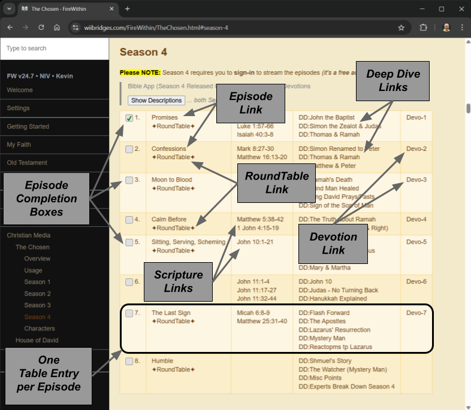

# The Chosen (FireWithin)

_**I'm very exited to announce**_ that 
[version 24.7](https://wiibridges.com/FireWithin/history.html#v24_7) 
of [FireWithin](https://wiibridges.com/FireWithin) has added a 
[Visual Character Guide](https://wiibridges.com/FireWithin/TheChosen.html#characters)
to "The Chosen" page!  _To get a feel for this, check out the screen
shots (**below**)._

## At a Glance

If you're a fan of [*The Chosen*](https://thechosen.tv/), you know how
rich and layered the series is - both spiritually and narratively. To
make it easier to navigate all the supporting content, I’ve put
together a dedicated 
[**Chosen Resources Page**](https://wiibridges.com/FireWithin/TheChosen.html), 
part of my
[**FireWithin**](https://wiibridges.com/FireWithin/) Bible Study Blog.

This page consolidates episode links, commentary, study materials, and
more - all in one place.

Below are a few annotated screenshots to highlight what’s available.

- [Visual Character Guide](#🎭-visual-character-guide)
- [Consolidated Resource Links](#📚-consolidated-resource-links)
- [Descriptions](#📝-descriptions)
- [Final Note](#✅-final-note)

## 🎭 Visual Character Guide

With so many characters in *The Chosen*, it can be easy to lose track.  

The latest release of this page promotes a 
[Visual Guide](https://wiibridges.com/FireWithin/TheChosen.html#characters)
that highlights the key players _**(50+ and counting)**_ to help you follow
the story as it unfolds.

<!-- IMAGE ANNOTATION NOTES:

- TEXT: Hover over Image & Click TO Show Detail

-->

Simply match a face to the character you’re curious about - **and click
to learn more** about their role in the series, including:

- A brief **storyline summary**  
- Relevant **Bible references** (when applicable)  
- _Or an explanation for characters uniquely created for *The Chosen* to support the narrative_

<!-- IMAGE ANNOTATION NOTES:

- TEXT: Storyline Summary <<< TIMES TWO (BOTH Mary Magdalene & Tamar)
- TEXT: Bible References  <<< Mary Magdalene
- TEXT: Non Biblical Character Explanation <<< Tamar

-->

## 📚 Consolidated Resource Links

Each season features a streamlined table of episode-specific
resources, designed to help you easily track and explore key content:

- ✅ **Episode Completion Boxes** – keep track of your progress  
- 🎬 **Episode Links** – watch the episode directly from the source  
- 🗣️ **Roundtable Links** – insights from *The Chosen* team  
- 📖 **Scripture Links** – quick access to related scripture via the [YouVersion Bible App](https://www.youversion.com/)
- 🔍 **Deep Dive Links** – in-depth analysis from [The Chosen Sleuth](https://www.youtube.com/@TheChosenSleuth)
- 📚 **Devotion Links** – reflections from *The Chosen* team  

<!-- IMAGE ANNOTATION NOTES:

- TEXT: 1 for every bullit item (above)

-->

## 📝 Descriptions

Want a quick summary before diving in? Just toggle the **"Show
Descriptions"** button to reveal brief overviews for each series and
episode.  _Descriptions are hidden by default to keep the layout clean
and compact._

<!-- IMAGE ANNOTATION NOTES:

- TEXT: Expand descriptions (both series & episodes)

-->

## ✅ Final Note

This resource was built to support deeper engagement with *The
Chosen*-whether you're watching for the first time, rewatching with a
group, or studying it alongside Scripture.

Feel free to **share the page** with others who might find it
helpful. And if you have suggestions for additional features or links,
I’d love to hear them!

[Explore **The Chosen** page → here](https://wiibridges.com/FireWithin/TheChosen.html)

<!-- Brief words in promotion (email/TXT/ETC):

OP 1 (TXT MSG VERSION):
=======================

If you're a fan of The Chosen, I’ve pulled together a one-stop page with episode links, study tools, character guides, and more.

-or-

Love The Chosen? I made a quick-reference page with episode links, study guides, character info, and more.

Check out the quick overview here:
👉 MY-GIST-LINK

OP 2 (GENERAL EMAIL VERSION):
=============================

Subject: A Helpful Resource for The Chosen Fans

Hi [Name],

If you enjoy The Chosen, I’ve created a resource page that brings
together episode links, discussion tools, character guides, Bible
references, and more - all in one spot.

I put together a brief visual overview here:
👉 MY-GIST-LINK

Feel free to explore it, bookmark it, or share it with others who
might find it helpful!

Best,
Kevin

OP 2 (Small Group EMAIL VERSION):
=================================

Subject: Resource Page for The Chosen – For Your Study & Reflection

Hi friends,

I’ve put together a resource page to help get more out of The Chosen
series. It includes episode links, related Scripture, devotions,
character guides, and more - all in one place.

Here’s a quick overview with screenshots:
👉 MY-GIST-LINK

Feel free to take a look and share it with anyone who might benefit. I
hope it helps deepen your experience with the series!

Blessings,
Kevin

MY ORIGINAL:
============

I'm exited about the latest release of the FireWithin Chosen page.

- A new Characters section promotes a Visual Guide to the key players!
  There are so many it is hard to keep track (I currently have 50 entries).

- Each episode now catalogs a consise list of "hard to find" resources
  (consolidated per episode):

  * Episode Link
  * RoundTable Link (from The Chosen Team)
  * Scripture Links (Bible App)
  * Deep Dive Links (from The Chosen Sleuth)
  * Devotion Links (from The Chosen Team)

This promotional page highlights the new features through a few animated screen shots.

LINK: MY-GIST-LINK

--> 
