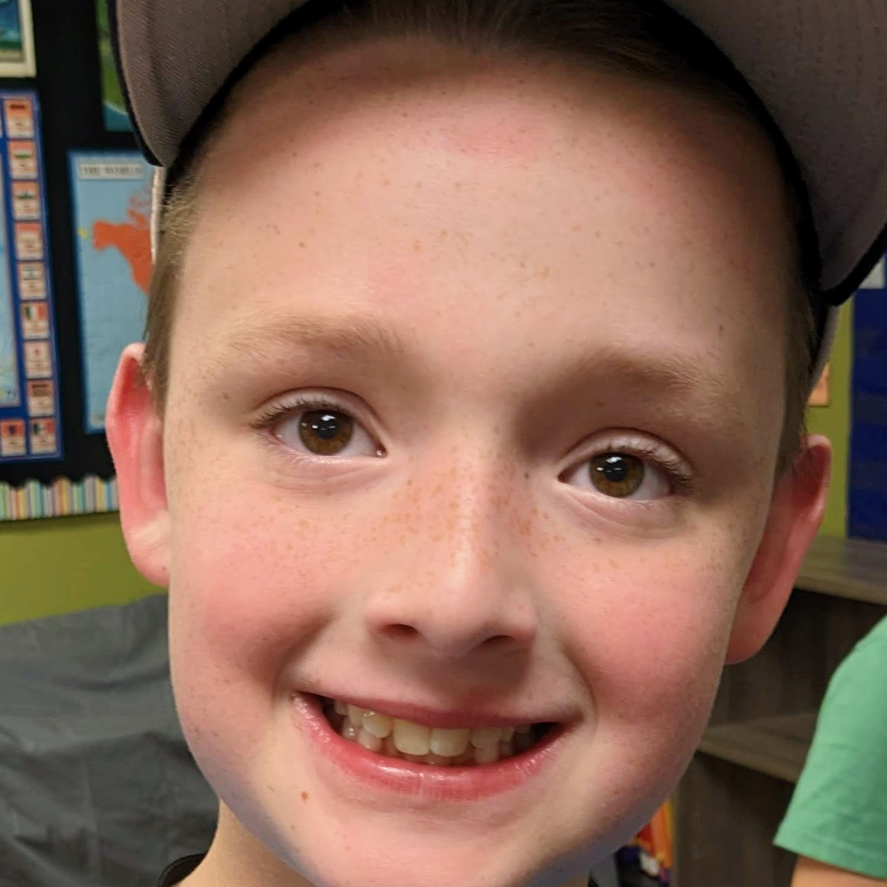
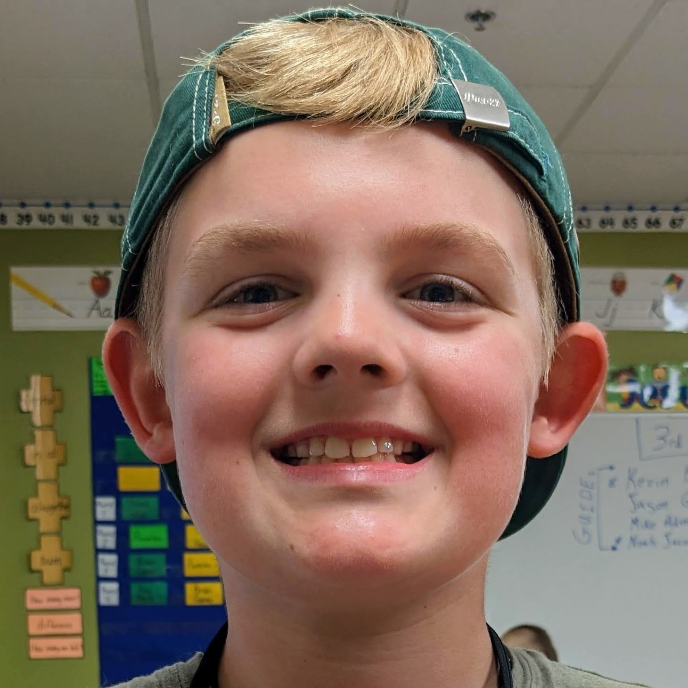
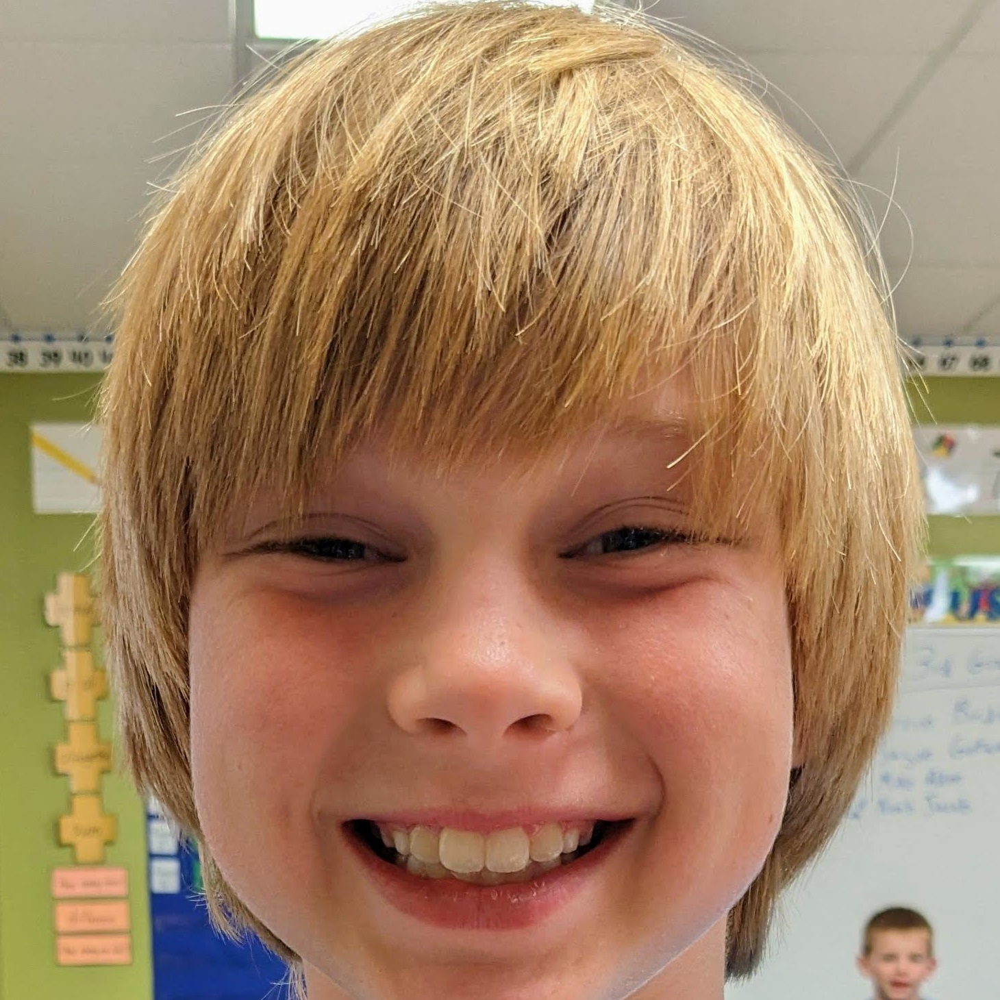
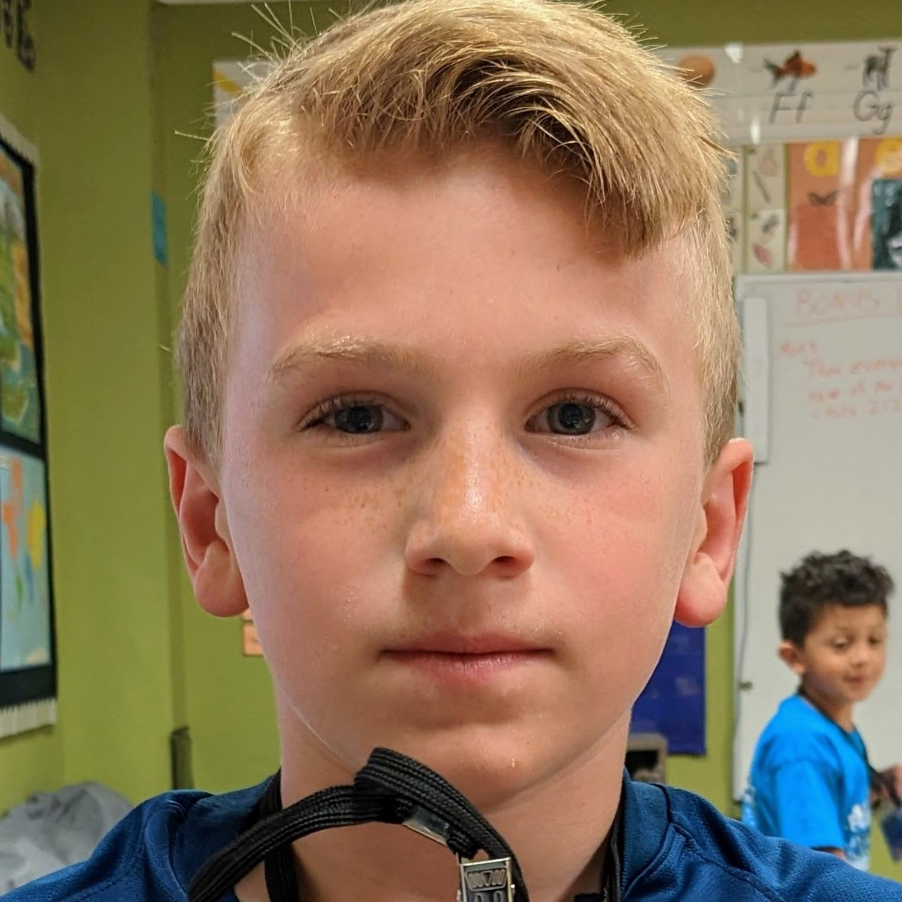
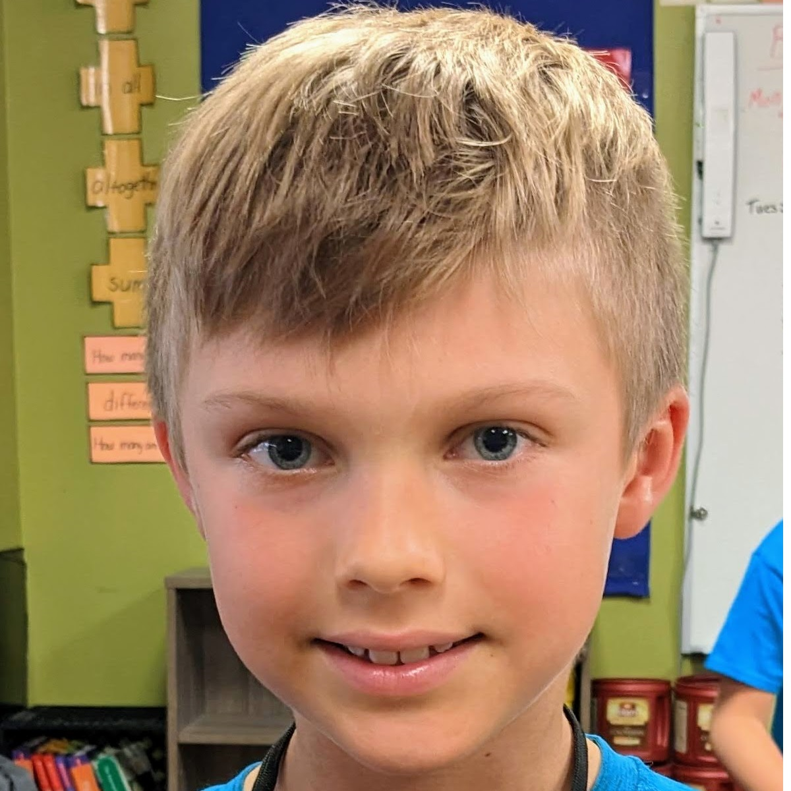
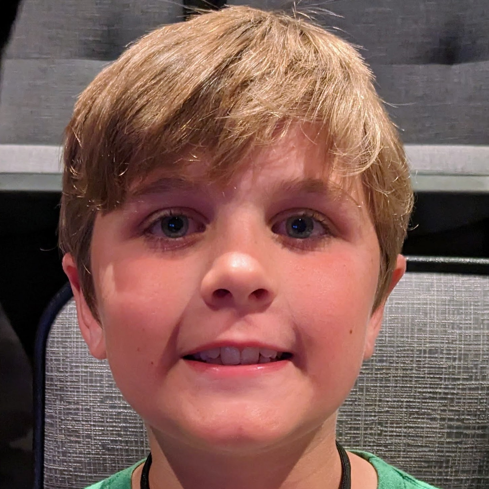

# VBS 2023 - Twists & Turns

Following Jesus changes EVERYTHING

591 Kids, 247 Volunteers 
_(last year: 471/247)_

### At a Glance

- [Master Church VBS Folder](https://drive.google.com/drive/folders/1A1MvtN0m6lFwdxddtmXtMBxhDr4aaZIj)
- [Guides](#guides)
- [Photos](#photos)
- [Kids](#kids)
- [Memory Verse](#memory-verse)
- [Schedule](#schedule)
- [Schedule (Friday)](#schedule-friday)
- [Themes](#themes)
  - [Orientation](#orientation)
  - [Mon 6/5: Jesus is Holy](#mon-65-jesus-is-holy)
  - [Tue 6/6: Jesus is Trustworthy](#tue-66-jesus-is-trustworthy)
  - [Wed 6/7: Jesus is Forgiving](#wed-67-jesus-is-forgiving)
  - [Thu 6/8: Jesus is Worth Following](#thu-68-jesus-is-worth-following)
  - [Fri 6/9: Jesus is for Everyone](#fri-69-jesus-is-for-everyone)
- [Maps](#maps)

## Guides

3rd Grade

- 3.1 Scrabble
  * Randy Largin
  * Ryan Thomas
  * Chase Boushard
- 3.2 <mark>Clue</mark>
  * Kevin Bridges
  * Jason Gotway (out M, F)
  * Mike Aden (w/child)
  * Noah Jacob (Student)
  * Teachers:
    - Lori Nazetta (Bible Study)
    - Steve & Karen Trask (Missions)
- 3.3 Life
  * Claire Bakley
  * Diane Martin
  * Sandy Ursch
- 3.4 Sorry
  * Mandi Thomas
  * Jennifer Richert
  * Carrie White
- Last Year
  - Tony Simmons _(now in 4th Grade)_
  - Kevin Bridges
  - Tara Johnson
  - Jill Harrison

**Guides Do This:**

- Be in room at 5:30 (start: 5:45)
- Greet Warmly
- Mark Attendance, both in Attendance Sheet (collected) -and- Roster
  * for NEW registrations, ADD to roster & attendance list
  * KEEP attendance list in red folder IN room
- NO "official" group restroom breaks
  * do on a single basis
  * OR at group level if convenient (after rec)
  * AVOID: Missions/Worship/Bible
- Help out on Crafts
- END 8:30pm
  * dismissed from classrooms
  * check parent security tag number with child
    - REQUIRED: NO EXCEPTIONS
    - Can accept phone-pic of security tag
  * KEEP lanyard
  * LEAVE group bag (with binders) IN ROOM

## Photos

- [Public](https://photos.app.goo.gl/HhFvw6TXzQm5BNrN6)
- [Internal](https://photos.app.goo.gl/2bLKtXAWQ3znCUnq7)
- [OLD 2022](https://photos.app.goo.gl/j6hFoAtSdDfyKt896)

## Kids

**Attendance:**

<table>

<tr>
  <td>  {{book.cb1}}VBS_KIDS_Barrett{{book.cb2}}     Barrett <!--   Oliver -->                 {{book.cb3}} </td>
  <td>  {{book.cb1}}VBS_KIDS_NA1{{book.cb2}}         Cam     <!--   Alexander -->              {{book.cb3}} </td>
  <td>  {{book.cb1}}VBS_KIDS_Carter2{{book.cb2}}     CarterF <!--   Foehrkalb -->              {{book.cb3}} </td>
</tr>
<tr>
  <td>  {{book.cb1}}VBS_KIDS_Carter1{{book.cb2}}     CarterV <!--   Vasatka -->                {{book.cb3}} </td>
  <td>  {{book.cb1}}VBS_KIDS_Connor1{{book.cb2}}     ConnorL <!--   Lindsay -->                {{book.cb3}} </td>
  <td>  {{book.cb1}}VBS_KIDS_Connor2{{book.cb2}}     ConnorM <!--   Munro -->                  {{book.cb3}} </td>
</tr>
<tr>
  <td>  {{book.cb1}}VBS_KIDS_Emric{{book.cb2}}       Emric <!--   Gotway -->                   {{book.cb3}} </td>
  <td>  {{book.cb1}}VBS_KIDS_Garrett{{book.cb2}}     Garrett <!--   Aden -->                   {{book.cb3}} </td>
  <td>  {{book.cb1}}VBS_KIDS_NA2{{book.cb2}}         Henry <!--   Crippen -->                  {{book.cb3}} </td>
</tr>
<tr>
  <td>  {{book.cb1}}VBS_KIDS_James{{book.cb2}}       James <!--   Hepp -->                     {{book.cb3}} </td>
  <td>  {{book.cb1}}VBS_KIDS_Jett{{book.cb2}}        Jett <!--   Nazetta -->                   {{book.cb3}} </td>
  <td>  {{book.cb1}}VBS_KIDS_Liam{{book.cb2}}        Liam <!--   Schlechte -->                 {{book.cb3}} </td>
</tr>
<tr>
  <td>  {{book.cb1}}VBS_KIDS_NA3{{book.cb2}}         Luke <!--   Warner -->                    {{book.cb3}} </td>
  <td>  {{book.cb1}}VBS_KIDS_NA4{{book.cb2}}         Miles <!--   Coleman -->                  {{book.cb3}} </td>
  <td>  {{book.cb1}}VBS_KIDS_NA5{{book.cb2}}         Parker <!--   Coleman -->                 {{book.cb3}} </td>
</tr>
<tr>
  <td>  {{book.cb1}}VBS_KIDS_NA6{{book.cb2}}         Ronan <!--   McGinnis -->                 {{book.cb3}} </td>
  <td>  {{book.cb1}}VBS_KIDS_Samuel{{book.cb2}}      Samuel <!--   Conforti -->                {{book.cb3}} </td>
  <td>  {{book.cb1}}VBS_KIDS_Vince{{book.cb2}}       Vince <!--   Gunn -->                     {{book.cb3}} </td>
</tr>
<tr>
  <td>  {{book.cb1}}VBS_KIDS_Zane{{book.cb2}}        Zane <!--   Gedmin -->                    {{book.cb3}} </td>
  <td>  &nbsp; </td>
  <td>  &nbsp; </td>
</tr>

</table>

<!-- TRASH ROSTER (TRASH - NO LONGER USED)

  <figure>
    

    <figcaption>ROSTER: Hover to zoom, Click to open in new tab</figcaption>
  </figure>

    -->

## Memory Verse

- **Main Verse**: you will be presented a set of "dog tags" in the worship rally!
- **Bonus Verses**: each additional verse you memorize adds your name to a
  drawing for a better chance at prizes at Friday worship rally _(the
  more verses you memorize - the better your chances to win a prize)_!

**Main Verse**

> "Make your ways known to me, Lord; 
> teach me your paths."
> ... [Psalms 25:4](https://www.bible.com/bible/1713/PSA.25.4.CSB)

**BONUS Verses**

- Mon 6/5: Jesus is Holy  
  > "Then everyone who calls on the name of the Lord will be saved."
  > ... [Acts 2:21](https://www.bible.com/bible/1713/ACT.2.21.CSB)

- Tue 6/6: Jesus is Trustworthy  
  > "Do not fear, for I am with you;  
  > do not be afraid, for I am your God.   
  > I will strengthen you;   
  > I will help you;   
  > I will hold on to you with my righteous right hand."
  > ... [Isaiah 41:10](https://www.bible.com/bible/1713/ISA.41.10.CSB)

- Wed 6/7: Jesus is Forgiving  
  > "In him we have redemption, the forgiveness of sins."
  > ... [Colossians 1:14](https://www.bible.com/bible/1713/COL.1.14.CSB)

- Thu 6/8: Jesus is Worth Following  
  > "There is salvation in no one else,  for there is no other name under heaven given to people by which we must be saved."
  > ... [Acts 4:12](https://www.bible.com/bible/1713/ACT.4.12.CSB)

- Fri 6/9: Jesus is for Everyone  
  > "All the prophets testify about him that through his name everyone who
  > believes in him receives forgiveness of sins."
  > ... [Acts 10:43](https://www.bible.com/bible/1713/ACT.10.43.CSB) 

## Schedule

<mark>Guides: Be Ready AT 5:30pm</mark>

<table>

<tr><td> {{book.cb1}}VBS_open{{book.cb2}}     5:45-6:10  <i>(25 mins)</i> {{book.cb3}} </td><td> C204                      Opening Activities                        </td> </tr>
<tr><td> {{book.cb1}}VBS_worship{{book.cb2}}  6:15-6:40  <i>(25 mins)</i> {{book.cb3}} </td><td> Worship Center            Worship Rally                             </td> </tr>
<tr><td> {{book.cb1}}VBS_bible{{book.cb2}}    6:40-7:10  <i>(30 mins)</i> {{book.cb3}} </td><td> FBM Chapel                Bible Study #1                            </td> </tr>
<tr><td> {{book.cb1}}VBS_snack{{book.cb2}}    7:10-7:30  <i>(20 mins)</i> {{book.cb3}} </td><td> C225 (Preteen Area)       Missions #2                               </td> </tr>
<tr><td> {{book.cb1}}VBS_missions{{book.cb2}} 7:30-7:40  <i>(10 mins)</i> {{book.cb3}} </td><td> Middle School Cafeteria   Snack                                     </td> </tr>
<tr><td> {{book.cb1}}VBS_reck{{book.cb2}}     7:40-8:00  <i>(20 mins)</i> {{book.cb3}} </td><td> E Gym #3 (H.S)            Recreation                                </td> </tr>
<tr><td> {{book.cb1}}VBS_crafts{{book.cb2}}   8:00-8:20  <i>(20 mins)</i> {{book.cb3}} </td><td> C204                      Crafts                                    </td> </tr>
<tr><td> {{book.cb1}}VBS_close{{book.cb2}}    8:20-8:30  <i>(10 mins)</i> {{book.cb3}} </td><td> C204                      Closing Group Time / Review and Dismissal </td> </tr>

</table>

## Schedule (Friday)

<table>

<tr><td> {{book.cb1}}VBS_open{{book.cb2}}     5:45-6:10  <i>(25 mins)</i> {{book.cb3}} </td><td> C204                      Opening Activities                        </td> </tr>
<tr><td> {{book.cb1}}VBS_bible{{book.cb2}}    6:10-6:35  <i>(25 mins)</i> {{book.cb3}} </td><td> FBM Chapel                Bible Study #1                            </td> </tr>
<tr><td> {{book.cb1}}VBS_snack{{book.cb2}}    6:35-6:55  <i>(20 mins)</i> {{book.cb3}} </td><td> C225 (Preteen Area)       Missions #2                               </td> </tr>
<tr><td> {{book.cb1}}VBS_missions{{book.cb2}} 6:55-7:05  <i>(10 mins)</i> {{book.cb3}} </td><td> Middle School Cafeteria   Snack                                     </td> </tr>
<tr><td> {{book.cb1}}VBS_reck{{book.cb2}}     7:05-7:25  <i>(20 mins)</i> {{book.cb3}} </td><td> E Gym #3 (H.S)            Recreation                                </td> </tr>
<tr><td> {{book.cb1}}VBS_crafts{{book.cb2}}   7:25-7:45  <i>(20 mins)</i> {{book.cb3}} </td><td> C204                      Crafts                                    </td> </tr>
<tr><td> {{book.cb1}}VBS_worship{{book.cb2}}  7:45-8:15  <i>(30 mins)</i> {{book.cb3}} </td><td> Worship Center            Worship Rally                             </td> </tr>
<tr><td> {{book.cb1}}VBS_close{{book.cb2}}    8:20-8:30  <i>(10 mins)</i> {{book.cb3}} </td><td> C204                      Closing Group Time / Review and Dismissal </td> </tr>

</table>

## Themes

********************************************************************************
### Orientation

- <mark>PREP</mark>: write Guide Names on the Board - write "main" memory verse

- <mark>6pm-6:10pm</mark>

- <mark>Welcome</mark> Welcome "Clue"!  We are so glad to see each one of you in this years VBS!
  * How many of you have been at our VBS in the past?
  * It is really exciting - we have almost 600 kids in our event this year!

- <mark>Clue</mark> This year we have a "game" theme - and our group is called "Clue"!

  * How many of you have played "Clue"?
  * YOU KNOW - that classic "Who done it game"
    ... _Colonel Mustard with the Candle Stick in the Dining Room_
  * It's a favorite of my grand kids

- <mark>Guides</mark> Well, this year the Clue group has 4 Guides _(I've written our names on the board)_

  * Introduce each, and MY NAME is "Mr. B."
  * Our job is to help out in any way we can
  * With the primary goal of getting you where you need to be for each event
    - those who have been with us before know that each activity is in a different location
    - the challenge is that we have 600 kids doing this at the same time
    - so it is important to stay with your group
    - we will be moving in a straight line (single file)
    - and we have a flag at the head of the group

- <mark>Memory Verses</mark> Like other years, we have a memory verse for you to work on.

  * when you feel like you are ready, you can find a Guide and recite it to them
  * and then you will be recognized in the worship rally, and get a prize _(a set of "dog tags" that you can wear the rest of the week)_!
  * OK something NEW this year is we also have "Bonus Memory Verses" _(one for each day)_.
    - just like the primary verse, you can recite it to your Guide.
    - for every bonus verse you memorize, your name will be added to a pot
      and at the end of the week there will be a drawing
    - so the more memory verses you do, the better your chances for an extra prize!

********************************************************************************
### Mon 6/5: Jesus is Holy

**Context:** _Peter Followed Jesus_ 
... [Matthew 4:18-20](https://www.bible.com/bible/1713/MAT.4.18-20.CSB) 
... [Luke 5:1-11](https://www.bible.com/bible/1713/LUK.5.1-11.CSB) <mark>KEY</mark>

**Bonus Verse**: 
"Then everyone who calls on the name of the Lord will be saved."
... [Acts 2:21](https://www.bible.com/bible/1713/ACT.2.21.CSB)

**Cornerstone Teaching** [Sermon: Luke 4:31-5:11](https://cornerstonechapel.net/teaching/20140528/)

- Has anyone seen the TV series called "The Chosen"
  > We see this scene in the first series
- Why would Jesus use the boat to teach from?
  > Could the water be used to amplify? 
  > ... this was before any "amplifiers"
- Between Peter & Jesus, who knew about fishing?
  > Jesus was a carpenter 
  > .. by trade 
  > .. but we know He was more 
  > Peter was a comercial fisherman 
  > .. he knew a thing or two 
  > .. had been fishing ALL night
- Jesus asked Peter to move the boat out and cast their nets one more time
  > Peter was tired and ready to call it a day  
  > <mark>BUT because the "Master" asked, Peter obeyed</mark>
- What happened when Peter did what Jesus asked?
  > the "catch" filled two boats  
  > and almost sunk them
- What was Peter response?
  > Leave me Lord, for I am a sinner  
  > He recognized the power of Jesus
- What was Jesus response?
  > I will make you "Fishers of Men"  
  > And Peter followed Him
- <mark>When Jesus calls, we should heed him</mark>

********************************************************************************
### Tue 6/6: Jesus is Trustworthy

**Context:** _Peter Walked to Jesus on the Water_ 
... [Matthew 14:22-33](https://www.bible.com/bible/1713/MAT.14.22-33.CSB) 

**Bonus Verse**: 
"Do not fear, for I am with you;  
do not be afraid, for I am your God.   
I will strengthen you;   
I will help you;   
I will hold on to you with my righteous right hand."
... [Isaiah 41:10](https://www.bible.com/bible/1713/ISA.41.10.CSB)

**Cornerstone Teaching** [Sermon: Matthew 13:53-14:36](https://cornerstonechapel.net/teaching/20130605/)

- Typical Fishing Boat was 7' X 20'
- All the disciples were in the boat and a storm was raging
- Jesus appeared, walking on the water
- The disciples were very afraid
- Peter was the only disciple to step out and walk to Jesus
- His faith waivered and he started to sink
- <mark>Jesus rescued Peter</mark>
- IN John's account the boat was immediately transported to shore (another miracle)
- Other places where this miracle was recorded
  - [Matthew 14:22-33](https://www.bible.com/bible/1713/MAT.14.22-33.CSB):
    This passage recounts the event when Jesus walks on
    water and Peter attempts to do the same but starts sinking. It begins
    with Jesus sending his disciples ahead of him in a boat while he goes
    up a mountain to pray. During the night, a storm arises, and Jesus
    comes toward them, walking on the water.
  - [Mark 6:45-52](https://www.bible.com/bible/1713/MRK.6.45-52.CSB):
    This account is similar to the one in Matthew. It
    describes Jesus walking on the water and his disciples'
    reaction. Jesus gets into the boat with them, and the wind ceases.
  - [John 6:16-21](https://www.bible.com/bible/1713/JHN.6.16-21.CSB):
    This passage also tells the story of Jesus walking on
    water after the feeding of the five thousand. The disciples get into a
    boat and Jesus joins them by walking on the sea. They reach the other
    side of the sea safely.

********************************************************************************
### Wed 6/7: Jesus is Forgiving

**Context:** _Peter Denied Jesus and was Restored_ 
... [Luke 22:31-34](https://www.bible.com/bible/1713/LUK.22.31-34.CSB) [54-62](https://www.bible.com/bible/1713/LUK.22.54-62.CSB) 
... [John 18:15-18](https://www.bible.com/bible/1713/JHN.18.15-18.CSB) [21:1-19](https://www.bible.com/bible/1713/JHN.21.1-19.CSB) 

**Bonus Verse**: 
"In him we have redemption, the forgiveness of sins."
... [Colossians 1:14](https://www.bible.com/bible/1713/COL.1.14.CSB)

**Cornerstone Teaching** [Sermon: John 20:19-21](https://cornerstonechapel.net/teaching/20151014)

- All the points in our recent Small Group

********************************************************************************
### Thu 6/8: Jesus is Worth Following

**Context:** _Peter spoke boldly about Jesus_ 
... [Acts 3:1 - 4:24](https://www.bible.com/bible/1713/ACT.3.CSB)  

**Bonus Verse**: 
"There is salvation in no one else,  for there is no other name under heaven given to people by which we must be saved."
... [Acts 4:12](https://www.bible.com/bible/1713/ACT.4.12.CSB)

**Cornerstone Teaching** [Sermon: Acts 4](https://cornerstonechapel.net/teaching/20151209/)

- Many thousands of people believed in the the gospel message of the
  life, death, burial, and resurrection of Jesus!
- Salvation through Jesus alone is an exclusive claim win an inclusive aim!
  **It is not narrowminded, because it is available to all!**
- God is not looking for the most polished, best educated, He is looking
  for people who are surrendered to Him.

********************************************************************************
### Fri 6/9: Jesus is for Everyone

<mark>INCLUDING Me</mark> _(not just the Jews)_

**Context:** _Peter told Cornelius About Jesus_ 
... [Acts 10](https://www.bible.com/bible/1713/ACT.10.CSB) 

**Bonus Verse**: 
"All the prophets testify about him that through his name everyone who
believes in him receives forgiveness of sins."
... [Acts 10:43](https://www.bible.com/bible/1713/ACT.10.43.CSB) 

**Cornerstone Teaching** [Sermon: Acts 10](https://cornerstonechapel.net/teaching/20160203)

- Cornelius
  * was a Gentile
  * was a Roman centurion
  * was devout and God-fearing
  * he gave generously
  * he prayed regularly
  * even though he was devout, he <mark>still needed Jesus</mark>
- Peter and Simon
  * Peter was staying at the home of a Jewish man named Simon, which
    was very unusual because of his profession as a Jew.
  * It’s worth noting that as a tanner, Simon had to be in contact with dead
    animals, which was strictly forbidden for godly Jews.
  * Simon the tanner would have been considered unclean, and, therefore,
    he had to live outside of town.
  * Pastor Gary said, “There are some things that we do because it’s simply
    tradition. … Tradition would have taught Peter [that he should never go
    near much less into the house of an unclean person! Peter didn’t seem
    to be concerned with traditions that weren’t in the Scriptures.] There’s
    a lot of traditions that we embrace, and we believe and that we think
    are right, and they may not be biblical. [Peter was] going to have his
    heart stretched [to] accept something or someone or a group of
    people who up until this point, he would never have accepted.” 
- Peter and Cornelius
  * Peter rejected Cornelius’ “worshipful” greeting.
  * Peter shared a simple message about the life, death, and resurrection of
    Jesus.
  * Everyone in Cornelius’ household heard, received, and believed the truth
    about Jesus, and they were saved.
  * The Holy Spirit came in response to their faith in Jesus, and they were
    baptized in the Spirit.

## Maps

  <figure>
    

    <figcaption>BASE: Hover to zoom, Click to open in new tab</figcaption>
  </figure>

  <figure>
    

    <figcaption>FIRST: Hover to zoom, Click to open in new tab</figcaption>
  </figure>

  <figure>
    

    <figcaption>RECK: Hover to zoom, Click to open in new tab</figcaption>
  </figure>

