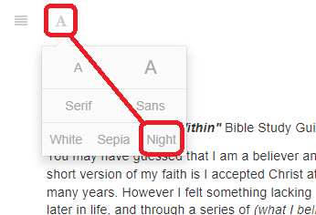
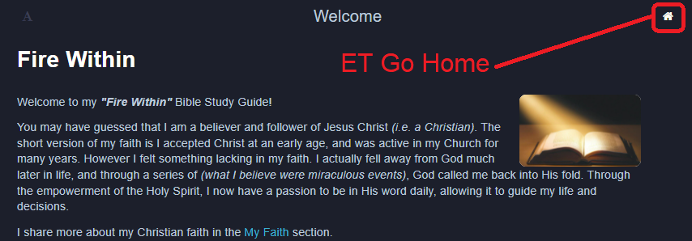
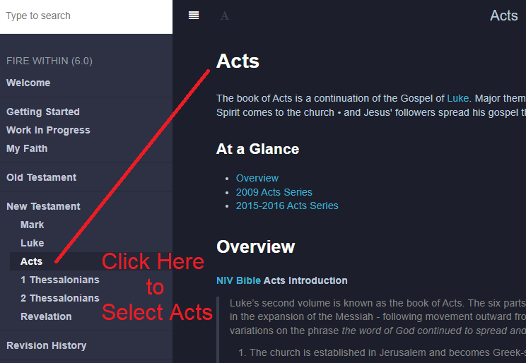
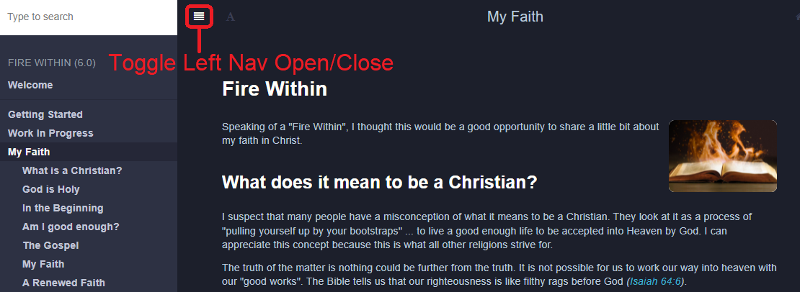
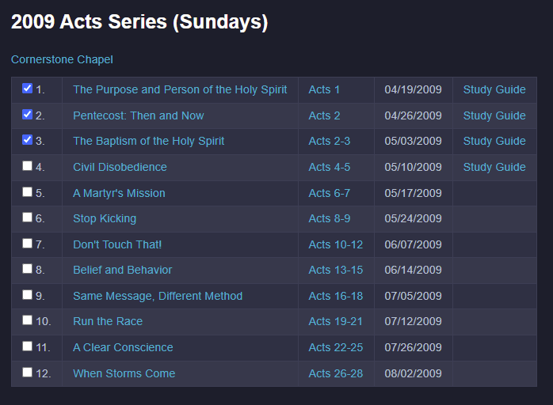
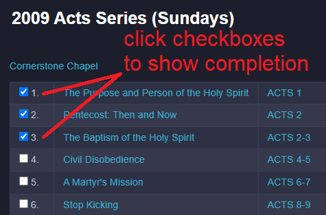
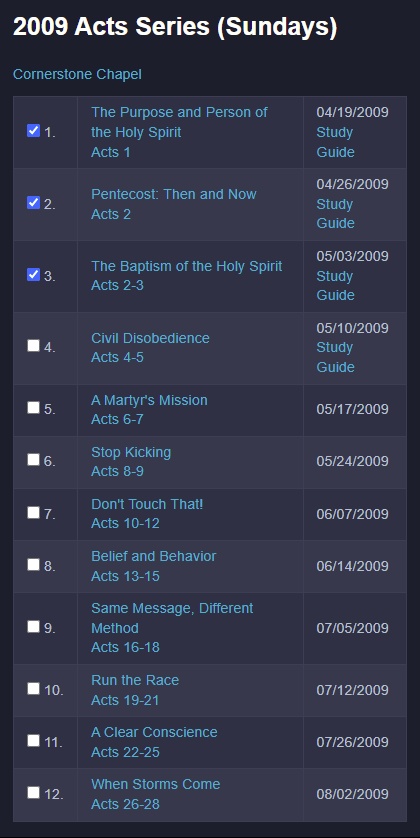

# Getting Started

Overall the _**"Fire Within"**_ Bible Study Guide is simple to use.
It is, _at it's core_, simply a consolidated list of resource links to
help you in your Bible Study.  With that said, this section highlights
a number of things that you should know to get the most out of this
site.

## At a Glance

- [Quick Start](#quick-start)
- [Basic Appearance](#basic-appearance)
- [Going Home](#going-home)
- [Left Nav Bar](#left-nav-bar)
- [Scripture References](#scripture-references)
  * [Bible Translation](#bible-translation)
- [Resource Links](#resource-links)
- [Where Am I?](#where-am-i)
- [Cell Phones](#cell-phones)
  * [More on Left Nav Bar](#more-on-left-nav-bar)
- [Diagrams](#diagrams)

## Quick Start

If you are visually inclined, watch this presentation on how to use
Fire Within.  It will walk you through all the details!

M{ youTube(`mpLuM7uXTq8`) }M

 **VIDEO CONTENT (Quick Links):**

  <b>Teaser</b> 
  <ul>
    <li>00:00 Teaser
  </ul>

  <b>Introduction</b> 
  <ul>
    <li>04:14 Introduction
  </ul>

  <b>Getting Started</b> 
  <ul>
    <li>06:15 Getting Started
    <li>07:16 FireWithin URL
    <li>07:32 Style the Site
    <li>08:35 Page Navigation
    <li>10:14 Scripture Links
    <li>11:09 Bible Translations
  </ul>

  <b>Bible Study</b> 
  <ul>
    <li>12:20 Bible Study
    <li>16:28 &nbsp;&nbsp;&nbsp;Side Bar: External Sites Launch New Browser Tab
    <li>17:24 &nbsp;&nbsp;&nbsp;Side Bar: Completion Checkboxes
  </ul>

  <b>Devotions</b> 
  <ul>
    <li>18:40 Devotions
    <li>22:22 &nbsp;&nbsp;&nbsp;Side Bar: Next/Prev Page
    <li>23:28 Working Daily Devotions
    <li>25:43 Finding Devotions by Scripture
    <li>27:57 &nbsp;&nbsp;&nbsp;Side Bar: Reddish Arrow of Scripture Reference - Quick Access to FireWithin's Book of the Bible
    <li>29:02 Related Sermon/Devotion
    <li>29:32 &nbsp;&nbsp;&nbsp;Side Bar: Tool Tip Hover
  </ul>

  <b>Mobile Devices (FireWithin is Reactive)</b> 
  <ul>
    <li>31:53 Cell Phone Usage
  </ul>

  <b>Multi-Device</b> 
  <ul>
    <li>35:53 Using Multiple Devices
    <li>37:27 Keeping Multiple Devices In-Sync (automatically)
    <li>42:16 Syncing is EVEN Real-Time!
  </ul>

  <b>More</b> 
  <ul>
    <li>43:41 Specials
  </ul>

  <b>The Chosen / House of David</b> 
  <ul>
    <li>45:48 Christian Media
    <li>47:35 A Visual Character Guide
  </ul>

  <b>Memorizing Scripture</b> 
  <ul>
    <li>48:59 Memorizing Scripture
  </ul>

  <b>Revision History</b> 
  <ul>
    <li>50:48 Revision History
  </ul>

  <b>Closing Remarks</b> 
  <ul>
    <li>52:24 Wrap Up
  </ul>

## Basic Appearance

You can change the basic appearance of the site through the **Text
Menu**, found in the upper-left of the page.  You can change the
&bull; text size &bull; display font &bull; and color theme _(I prefer
the "Night" theme, giving you a dark mode)_.

  

## Going Home

The **Home** menu _(found in the upper-right of the page)_ will take
you back to the wiiBridges home page.

  

## Left Nav Bar

The books of the Bible are accessed through the **Left Nav Bar**.
They are found in the Old and New Testament sections, which are
themselves expandable.  By simply clicking the desired book, you will
will be taken to the study resources for that book.

  

 

<b>Open/Close the Left Nav Bar</b>

The **Left Nav Bar** itself is expandable using the menu control found in
the upper-left of the page.  This control is a toggle that will either
expand or contract the **Left Nav Bar**.

  

## Scripture References

Throughout this site, there are over 3,000 scripture references!

As an example, consider: M{ bibleLink(`jhn.3.16@@John 3:16`) }M

- ALL scripture references are links that launch the YouVersion Bible
  App - so you can "Dig Deeper" electronically!

- In addition, you will find a reddish-tinted arrow, just to the right
  of most scriptures.  This is a convenience control that takes you to
  the FireWithin book for that scripture _(in our example -
  {{book.John}})_.  This allows you to quickly research other
  resources that FireWithin has for that book of the Bible.

  The only time you will not see this control, is if you are already
  on that page.  In other words, if you are already in the book of
  John, it wouldn't make sense to say "take me to the book of John" :-)

## Bible Translation

The YouVersion Bible App supports many different Bible Translations.

FireWithin allows you to specify which translation you wish to use
through a central setting.  This automatically impacts ALL 3,000+
scriptures found throughout the FireWithin site!

Check out the {{book.BibleTranslation}} setting!!

<!-- 

## Search

KJB: Search feature does NOT work very well ... nix this (commented out)

You may search the content of the blog through the search box found at
the top of the **Left Nav Bar**.

**Please Note** that because the blog content is primarily links to
other resources, this feature is only useful when the term you are
searching for is contained in the sermon title, or the introductory
pros.

-->

## Resource Links

As mentioned in the [Welcome Page](intro.md), this site is merely an
accumulation of resource links that guide me through the books of the
Bible.  Because they are concisely organized, it helps in keeping
track of where you are your study.

  <b>Desktop Rendition</b> 
  

> A word about the resource links found in this site ... they will
> consistently take you to another tab in your browser.  This is done
> purposefully, so you won't loose your place in your study.  To get
> back to this page, simply re-select it in your browser tabs.

## Where Am I?

It can sometimes be hard to remember where you left off in your study
... especially when there are a large number of lessons in a series.
For that reason, you will find a "Completed Checkbox" for each lesson
of a Sermon Series.  By simply clicking the checkbox, it will be
remembered the next time you come back.

  

**At a higher level**, you can also <mark>keep track of which books of
the Bible you have completed</mark>.  This is summarized in both the
{{book.OldTestament}} and {{book.NewTestament}} pages, and also found
at the top-right of each page that represents a book of the Bible.

M{ injectSyncNote(`completed checks`) }M

## Cell Phones

Fire Within is capable of running on many different device types,
including Mobile Devices _(such as Cell Phones and Tablets)_.

Because of Fire Within's responsive design, it can handle devices with
much smaller screens.

As an example, the Cell Phone Sermon Series will take on a slightly
different appearance.  It has a more vertical layout, with only 3
columns (instead of 5).

  <b>Phone Rendition</b> 
  

While Cell Phones have smaller screens to work with, they are useful
in many different situations:

- You may want to audio stream a sermon on your commute or workout.
- You can always cast a sermon series from your phone to a TV!
- Remember: if your mobile device has [You
  Version](https://www.bible.com/) Bible App installed, all scripture
  references will be serviced by the Bible App _(which has more
  features than it's web counterpart)_!

## More on Left Nav Bar

One of the biggest differences of Cell Phone usage is the **Left Nav
Bar** - which behaves differently, depending on how much screen real
estate you have:

- For a Desktop/Laptop/Tablet, the **Left Nav Bar** will start out
  open, and remains open as you navigate the site.

- For a Cell Phone, the **Left Nav Bar** will start out closed and
  automatically close on each menu selection.

  As an example, if you need to navigate to a different top-level page,
  you will need to:
  1. [expand](#expand-left-nav) the **Left Nav Bar**
  2. select the new top-level page
      ... the new page will display, and the **Left Nav Bar** will close

## Diagrams

In some cases, a presentation or sermon series will use a detailed
diagram to get their points across.  When this happens _(and I have
the time)_, I will extract that diagram and make it available as one
of the resources of this site.

These diagrams are typically fairly large, and may not be readable
when restricted by the browser window.  As a result, I have added the
following features:

- You can "hover over the diagram" with your mouse, and it will
  zoom/expand on that section.  On a cell phone you can "press and
  hold" your finger to get the same effect.

- You can also "click the diagram" to open it in a new tab of your
  browser.
  * from there you can re-orient the browser window so it is visible
    concurrently with the video presentation
  * you can also print the diagram by using your browser controls

> Try this out for yourself with the following sample _(taken from the
> [Revelation](Revelation.md) series)_:

M{ zoomableImg(`RevelationTimeline_CS`) }M
