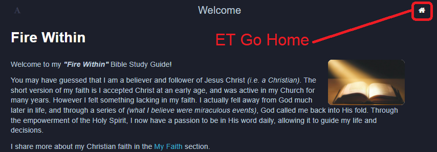
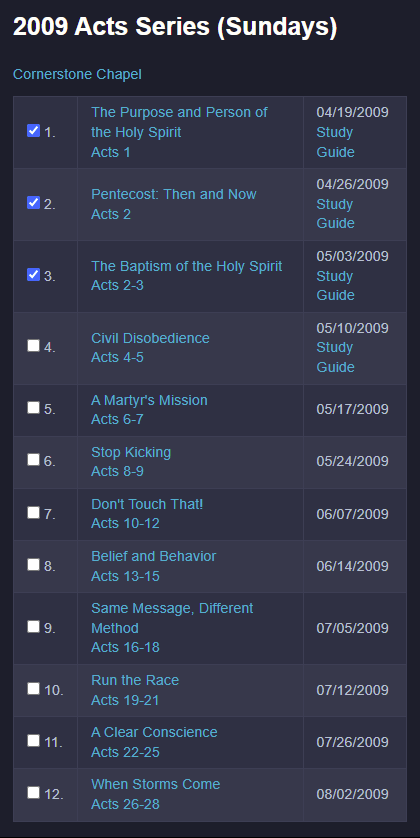

# Getting Started

Overall the _**"Fire Within"**_ Bible Study Guide is simple to use.
It is, _at it's core_, simply a consolidated list of resource links to
help you in your Bible Study.  With that said, this section highlights
a number of things that you should know to get the most out of this
site.

## Basic Appearance

You can change the basic appearance of the site through the **Text
Menu**, found in the upper-left of the page.  You can change the
&bull; text size &bull; display font &bull; and color theme _(I prefer
the "Night" theme, giving you a dark mode)_.

  

## Going Home

The **Home** menu _(found in the upper-right of the page)_ will take
you back to the wiiBridges home page.

  

## Left Nav Bar

The books of the Bible are accessed through the **Left Nav Bar**.
They are found in the Old and New Testament sections, which are
themselves expandable.  By simply clicking the desired book, you will
will be taken to the study resources for that book.

  

The **Left Nav Bar** itself is expandable using the menu control found in
the upper-left of the page.  This control is a toggle that will either
expand or contract the **Left Nav Bar**.

  

_**Responsive Design**_

The **Left Nav Bar** will behave differently, depending on whether you
use it on a desktop _(or tablet)_ or a smaller device _(such as a cell
phone)_.
       
> _**Desktop (or Tablet)**_
> 
> - Because a desktop _(or tablet)_ has more real estate to work with ...
> - The **Left Nav Bar** will start out open and remain open as you navigate the site.
> 
> _**Phone**_
> 
> - Because a cell phone has less real estate to work with ...
> - The **Left Nav Bar** will start out closed and automatically close on each menu selection.
>   As an example, to select a book in the New Testament _(assuming you
>   are not already in the New Testament)_, you will need to:
>   1. expand the **Left Nav Bar**
>   2. select "New Testament"
>      ... the New Testament splash page will display, and the **Left Nav Bar** will close
>   3. expand the **Left Nav Bar** once again
>      ... the New Testament menu has now expanded
>   4. select the desired book (ex: Acts)

## Resource Links

As mentioned in the [Welcome Page](intro.md), this site is merely an
accumulation of resource links that guide me through the books of the
Bible.  Because they are concisely organized, it helps in keeping
track of where you are your study.

  <b>Desktop Rendition</b> 
  

> A word about the resource links found in this site ... they will
> consistently take you to another tab in your browser.  This is done
> purposefully, so you won't loose your place in your study.  To get
> back to this page, simply re-select it in your browser tabs.

_**Responsive Design**_

The layout of the sermon series links will have a slightly different
appearance, depending on whether you use it on a desktop _(or tablet)_
or a smaller device _(such as a cell phone)_.
       
> _**Desktop (or Tablet)**_
> 
> - A desktop _(or tablet)_ has more real estate to work with on your
>   screen.
> - The sermon series will have a more horizontal layout _(with up
>   to 5 columns)_.
> 
> _**Phone**_
> 
> - While a cell phone has less real estate, it is useful if you want to
>   stream audio during your commute or workout.
> - The sermon series will have a more vertical layout _(with only
>   3 columns)_.
> - If you have the [You Version](https://www.bible.com/)
>   Bible App installed on your phone, the scripture references will be
>   serviced by the Bible App!
> - **Remember** - you can always cast a sermon series from your phone to a TV!

  <b>Phone Rendition</b> 
  

## Where Am I?

It can sometimes be hard to remember where you left off in your study
... especially when there are a large number of lessons in a series.
For that reason, you will find a "Completed Checkbox" for each lesson
of a Sermon Series.  By simply clicking the checkbox, it will be
remembered the next time you come back.

  

**At a higher level**, you can also <mark>keep track of which books of the Bible
you have completed</mark>.  This is found in both the {{book.OldTestament}}
and {{book.NewTestament}} pages.

> Please Note that the "Complete Checkbox" state is held in your
> local device.  That means the status will not follow you when you
> use multiple devices _(say a laptop and a cell phone)_.  In other
> words, it's really the status of the device you are using.
> 
> This feature is merely meant to be a convenience, and was
> implemented using the simplest technique.

## Bible Translation

The {{book.Settings}} page has a **User Preference** that allows you to specify which
{{book.BibleTranslation}} you wish to use ... **check it out**!

## Diagrams

In some cases, a presentation or sermon series will use a detailed
diagram to get their points across.  When this happens _(and I have
the time)_, I will extract that diagram and make it available as one
of the resources of this site.

These diagrams are typically fairly large, and may not be readable
when restricted by the browser window.  As a result, I have added the
following features:

- You can "hover over the diagram" with your mouse, and it will
  zoom/expand on that section.  On a cell phone you can "press and
  hold" your finger to get the same effect.

- You can also "click the diagram" to open it in a new tab of your
  browser.
  * from there you can re-orient the browser window so it is visible
    concurrently with the video presentation
  * you can also print the diagram by using your browser controls

> Try this out for yourself with the following sample _(taken from the
> [Revelation](Revelation.md) series)_:

  <figure>
    

    <figcaption>Hover to zoom, Click to open in new tab</figcaption>
  </figure>

